# Chrysalis Design

Chrysalis is a small, embeddable distributed process namespace and stream
transport. Its long-term goal is to provide reusable connectivity for
distributed applications, in the same sense that SQLite provides an embeddable
database: a library that can be linked into an existing binary without requiring
a sidecar or an external control-plane service.

At its core, Chrysalis provides a global namespace of processes and the ability
to establish cheap, opaque bidirectional streams between them. QUIC connections
are pooled, so opening each additional stream is 0-RTT: it requires no new
connection setup or cryptographic handshake. At the namespace layer, stream
liveness is process liveness: there is no separately advertised endpoint whose
lifecycle can diverge from its process. The resulting model can be thought of as
a process mesh.

Two design choices keep this model small:

1. **A lifecycle-aligned global nameserver.** The namespace is logically global
   but physically organized as a hierarchy that follows process lifecycle and
   connectivity boundaries. Each parent link owns its child's complete
   publication, so naming, aggregation, and failure fencing compose recursively.
2. **A datagram-only forwarding plane.** QUIC runs end to end between processes
   and owns authentication, connections, reliability, and stream multiplexing.
   Middleboxes only forward datagrams using the destination PID encoded in the
   QUIC connection ID. They retain namespace-derived routes and lifecycle gates,
   but no per-connection QUIC state and no knowledge of application streams.

The system is deliberately stratified:

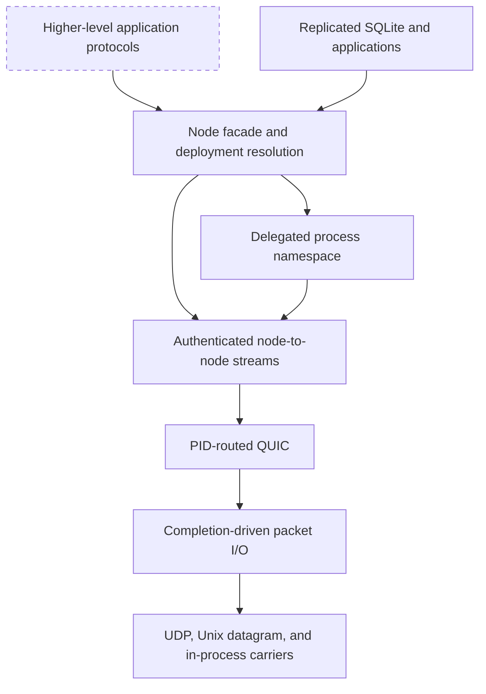

Each layer is independently useful. An application may use the completion core,
packet drivers, datagram router, QUIC stream transport, nameserver, or integrated
`Node` facade. The optional SQLite layer demonstrates a stateful protocol above
adjacent link streams. Other application protocols remain above opaque
node-to-node streams rather than responsibilities of the base transport.

This document describes the implemented version-one design. Later sections
identify the intended extension points and the features that are not yet part of
the system.

## Goals

Chrysalis has five primary goals:

1. **Embeddability.** The system is a set of libraries. It requires no external
   daemon, database, or configuration service.
2. **Layering.** Identity, datagram transport, QUIC, naming, and application
   protocols have explicit boundaries.
3. **Topology independence.** A process may be directly reachable, behind a
   host gateway, or inside a restricted container that can reach only a Unix
   socket.
4. **Recursive composition.** Every node may be a nameserver and packet
   forwarder for its children. The same protocol is used at every level.
5. **Failure-correlated state.** A child's complete publication is owned by one
   live parent link. Losing that link fences all forwarding derived from it.

Version one favors a small, legible mechanism over generality. It uses one
parent per node, one logical namespace, singleton in-memory nameservers, and
opaque bidirectional streams.

## Core Model

### Nodes and PIDs

A `Node` represents one logical process. It owns one 128-bit process identifier:

```rust
struct Pid([u8; 16]);
```

The PID is self-certifying. Chrysalis computes it as the first 128 bits of
SHA-256 over the process's leaf certificate in DER form. Replacing the
certificate creates a new PID. The embedder supplies the DER leaf, PEM
certificate chain, PEM private key, trust roots, and server-name policy through
`QuicIdentity`.

The implemented process-incarnation model uses a fresh certificate, and
therefore a fresh PID, after restart. The Meta identity provider enforces this by
issuing one leaf certificate per node. Core Chrysalis still derives identity
only from that leaf: an embedder that deliberately reuses a certificate can
reconnect with the same PID.

A future user that requires terminal process incarnations needs a stronger core
contract: constructing a new `Node` must always create a fresh PID, and an
established connection that Chrysalis reports as broken must never reconnect.
That strengthening is not part of this implementation stack; it requires adding
an authenticated incarnation value or an equivalent one-shot identity mechanism
to core Chrysalis.

PID zero is reserved:

```text
00000000000000000000000000000000 = link-local protocol mux
```

PID zero is never published or routed globally. It identifies the protocol mux
at an explicitly configured adjacent address. The nameserver and optional
embedded modules select independent streams through that mux.

### Process entries

The namespace maps a PID to contextual connection information:

```rust
struct ProcEntry {
    pid: Pid,
    tls_server_name: String,
    labels: Labels,
    locators: Vec<Locator>,
}

struct Locator {
    address: DatagramAddr,
    priority: u32, // lower is preferred
}
```

A locator is a next hop from the observer's position, not necessarily the
target's physical address. `tls_server_name` and `labels` describe the final
process and remain unchanged as gateways rewrite locators. If process `C` is
behind gateways `B` and `A`, the same PID has different next hops at each level:


This contextual rewriting is what permits arbitrary network boundaries without
putting a complete source route into every packet.

Labels are immutable, validated Kubernetes-style key/value metadata. They are
published and aggregated with the process entry but do not affect identity or
routing. Operators and higher layers can use them to describe placement and
role. The scale runner publishes labels such as `rank`, `task`, `role`, `level`,
and `topology`.

### Streams, not endpoints

The base system addresses processes, not application endpoints or ports.
`dial(pid)` opens an opaque QUIC bidirectional stream, and `accept()` returns a
stream with the authenticated source PID. Chrysalis adds no stream header,
method selector, or message envelope.

QUIC connections are pooled and reused. Once two processes have established a
connection, each `dial(pid)` can cheaply open a fresh bidirectional stream
without another transport or cryptographic handshake. Applications can use
these independent streams to multiplex request/response exchanges, protocol
sessions, and other concurrent work over one connection.

Applications may build ports, protocol negotiation, RPC, or message channels on
top of streams. Keeping those concepts out of the transport is what allows the
transport and nameserver to remain independently useful.

## Crate Structure

The repository is organized as OSS-style Cargo crates while retaining Buck as
the internal build system:

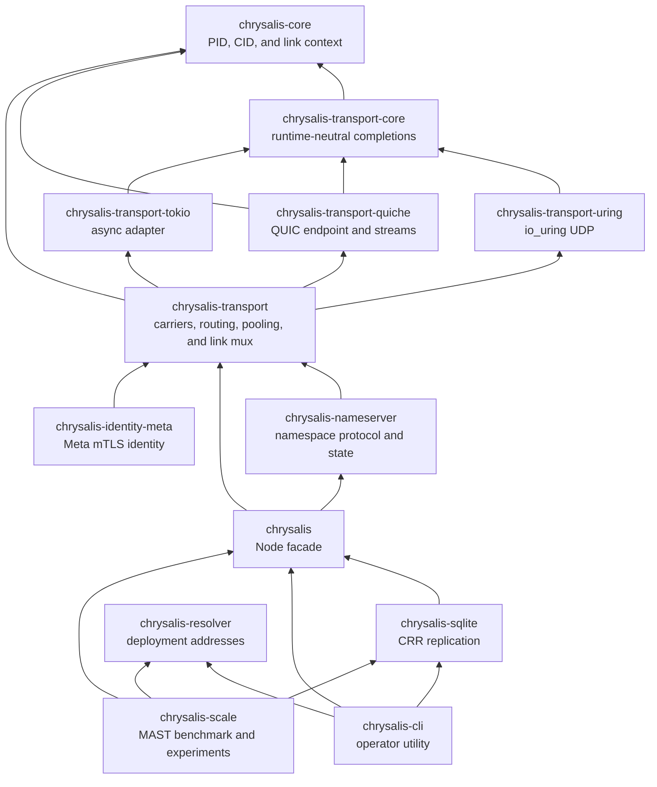

Dependencies point upward. The completion core has no runtime or QUIC
dependency, the transport has no nameserver dependency, and the nameserver does
not depend on `Node`. `Node` composes concrete lower-layer components without
hiding their handles. Resolver, SQLite, CLI, scale, and Meta identity support
remain optional layers outside the core dependency path.

## Data Plane

### Completion-driven transport

The transport separates protocol ownership from async-runtime integration. The
runtime-neutral core defines bounded submission and completion queues,
operation IDs, buffer ownership transfer, cancellation, and wakeups. The quiche
driver owns QUIC state on one driver thread, while the Tokio adapter translates
completion handles into `Future`, `AsyncRead`, and `AsyncWrite` interfaces.

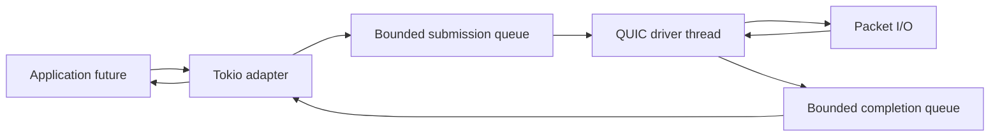

Ordered per-direction stream queues prevent operations from overtaking one
another. Completion credits bound retained buffers and commands end to end.
Cancellation returns caller-owned buffers, and terminal streams are reclaimed
without scanning historical stream IDs.

### Datagram sockets

The lowest I/O interface moves atomic datagrams:

```rust
trait DatagramSocket {
    fn local_addr(&self) -> &DatagramAddr;
    fn try_send_to(&self, datagram: &[u8], destination: &DatagramAddr)
        -> io::Result<()>;
    fn try_send(&self, transmit: &DatagramTransmit<'_>)
        -> io::Result<usize>;
    fn poll_send_ready(
        &self,
        cx: &mut Context<'_>,
        transmit: &DatagramTransmit<'_>,
    ) -> Poll<io::Result<()>>;
    fn poll_recv_from(
        &self,
        cx: &mut Context<'_>,
        buffer: &mut ReadBuf<'_>,
    ) -> Poll<io::Result<DatagramAddr>>;
    fn shutdown(&self);
    fn join(&self) -> Future<Output = ()>;
}
```

`try_send` returns the number of leading datagrams accepted from a segmented
transmission. Zero means that the carrier would block before accepting any
datagram. Other failures return an error only when no datagram was accepted;
after partial progress, the caller retries the unsent suffix and observes a
persistent error there. A zero result waits on `poll_send_ready` before retrying.

Send readiness is scoped to the transmission that returned `WouldBlock`.
Readiness-based carriers may ignore the destination when their writable state
is socket-wide. The in-process carrier instead registers each caller's waker on
the destination endpoint queue. Capacity checks and waker registration occur
under the same queue lock, so concurrent sends cannot overwrite one another's
wait state, and draining one endpoint does not wake senders blocked on another.

`DatagramAddr` is an opaque pair of transport scheme and bytes. Implemented
carriers are:

```text
udp://host:port
unixgram:///path
inproc://name
```

`DatagramSocketSet` combines one carrier per scheme. Receives are fanned in,
sends select a carrier by the destination scheme, and one designated primary
address is advertised by default. This allows one process to receive over UDP
and Unix datagrams while presenting one socket to the rest of Chrysalis.

Directly addressed UDP nodes may instead transfer their bound socket to the
runtime-neutral io_uring driver. A dedicated driver thread lets quiche assemble
packets directly into stable transmit slots, groups MTU-sized datagrams with
UDP GSO, and splits UDP GRO receives without routing packet I/O through Tokio.
`Node` still exposes the same stream and nameserver APIs. Nodes that need CID
forwarding, Unix datagrams, in-process carriers, or multiple carrier schemes use
the carrier-neutral switch backend; the two backends are an implementation
choice below the QUIC stream interface.

### CID routing

QUIC version 1 permits connection IDs up to 20 bytes. Chrysalis uses the full
width:

```text
CID = [destination PID: 16 bytes][local suffix: 4 bytes]
```

For a client-chosen Initial DCID, the suffix is an `InitialNonce`. For a CID
issued by the destination endpoint, it is a destination-local `ConnectionKey`.
The suffix demultiplexes QUIC state only at the final process. Forwarders inspect
only the 16-byte PID prefix.

Carrying the complete destination PID is what removes label distribution from
the forwarding plane. A forwarder can route toward a PID it has never seen and
holds no state for, because the datagram names its destination globally rather
than through a locally negotiated tag. No hop allocates, advertises, or retires
a per-connection label, and inserting a hop into a path requires only a
namespace-derived route rather than renegotiation with its neighbors. This is
what lets forwarding compose recursively and hold no per-connection QUIC state.

The CID is not authenticated. It is a routing claim that gets a datagram to the
process that can complete the authenticated QUIC handshake. A sender may write
any PID into a CID, but the datagram only reaches a process holding the
corresponding leaf certificate, so a false claim costs a wasted datagram rather
than a false identity.

> The forwarding plane routes only on the destination PID embedded in the QUIC
> CID. UDP addresses, ports, Unix socket paths, and other carrier coordinates
> are incidental next-hop information. They may be rewritten at every hop and
> never become part of process identity or end-to-end routing semantics.

The property costs sixteen of the twenty bytes QUIC version 1 permits, which
fixes the local suffix at four. Every future per-connection routing bit must fit
in that suffix, so an endpoint shard index, an incarnation epoch, and the
forwarding hint described under Future Work all compete for the same space.
QUIC version 1 does not permit a wider CID, so recovering room would require
narrowing the PID prefix.

### Datagram switch

Each `Node` owns one `DatagramSwitch` over its carrier socket. The switch binds
two local destinations:

```text
node PID -> application QUIC endpoint
PID 0    -> link-local protocol-mux QUIC endpoint
```

For every received datagram, the switch extracts the target PID from the first
QUIC packet's DCID. A local binding takes precedence. Otherwise, the switch
delegates to the `Router`.

The router holds destination-specific routes and one optional default route:

```text
route[C] -> next-hop address, optional route gate
default  -> parent address, parent-link route gate
```

The parent link installs a gated default route so descendants can send toward
the root. Child publications install gated PID-specific routes so traffic can
move down the tree. Unknown, malformed, unbound PID-zero, inactive, and
backpressured datagrams are deliberate drops. End-to-end QUIC provides loss
recovery.

### Route gates

Every route derived from one child link shares one terminal `RouteGate`.
Closing a gate:

1. prevents new sends from being admitted;
2. waits for already admitted nonblocking sends to return; and
3. leaves route-index cleanup for later.

Therefore, after `RouteGate::close` returns, no route derived from the dead link
can begin another send. Fencing one gate is independent of subtree size.

### End-to-end QUIC

Forwarders never terminate, unwrap, or re-encrypt application QUIC. They move
the original datagram bytes based on the destination CID. The final process
terminates QUIC and authenticates its peer.

`QuicTransport` pools one preferred outgoing connection per PID. Every physical
connection accepts streams from either peer, including connections that lose a
simultaneous-connect race. `dial` opens a bidirectional stream, and `accept`
returns the next peer-initiated stream.

The runtime-neutral quiche driver uses UDP-shaped addresses internally.
`CarrierPacketIo` contains that implementation detail by maintaining a
process-local mapping between stable `DatagramAddr` values and synthetic IPv6
addresses. The synthetic addresses never enter the namespace.

### Life of a stream: direct peer path

The lowest-overhead path applies when two nodes are directly UDP-reachable and
use the io_uring backend. Assume that A already has an authenticated pooled QUIC
connection to B. Opening another stream allocates a stream ID through the
bounded command and completion queues; it sends no packet and performs no new
TLS handshake. The first `send` makes the stream visible to B.

This path bypasses `DatagramSwitch`, `Router`, carrier adaptation, and Tokio
packet I/O. Tokio coordinates futures and completions, while one dedicated
driver thread owns quiche and the UDP socket.

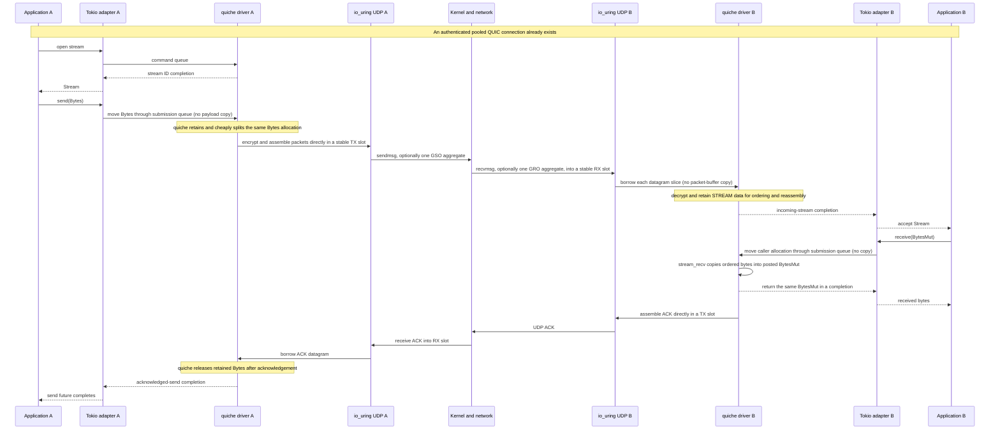

The diagram distinguishes ownership transfer from copying. For one direction of
steady-state application data, excluding NIC DMA and protocol metadata:

1. The application gives `Bytes` ownership to the submission queue. The driver
   wraps it in quiche's splittable send buffer, so queueing, segmentation,
   retransmission, and acknowledgement tracking do not copy the plaintext.
2. Quiche reads that plaintext while encrypting and packetizing directly into a
   stable io_uring transmit slot. There is no intermediate packet buffer. UDP
   GSO can place several equal-sized QUIC datagrams in that allocation and issue
   one `sendmsg`.
3. The ordinary UDP send path copies the transmit slot into the kernel. The
   production path does not use `MSG_ZEROCOPY`; GSO reduces operations, not this
   kernel-boundary copy.
4. At B, the kernel writes directly into a stable receive slot. UDP GRO may put
   several datagrams in one slot and one completion. The driver lends slices of
   that allocation to quiche without first copying each packet.
5. Quiche decrypts the packet and copies STREAM payload into its ordered
   reassembly storage. This copy is required because QUIC packets may arrive
   out of order, overlap, or outlive the reusable receive slot.
6. The application posts a `BytesMut`; quiche copies ordered stream bytes into
   its spare capacity. The completion returns that same allocation, so the
   completion queue and Tokio adapter add no payload copy.

Thus, the optimized send side has no plaintext queue or retransmission copy and
one encryption/packet-assembly write. The receive side has no intermediate
packet copy, followed by one copy into QUIC reassembly storage and one copy into
the caller's buffer. Stable slots, ownership-moving queues, GSO/GRO, pooled
connections, and a dedicated driver thread remove the other copies, syscalls,
handshakes, and scheduler crossings from the steady-state path.

### Authentication

Connections are expected to use mutual TLS. After quiche applies the embedder's
trust policy, Chrysalis derives the peer PID from the authenticated leaf
certificate. An outbound connection succeeds only if that PID equals the PID
requested by `dial`. Incoming streams carry the same authenticated PID.

The `chrysalis` CLI generates ephemeral leaf certificates under an embedded
development CA. That policy is suitable for the topology demonstration, not
for production authorization. Its optional `--identity=meta` mode uses the separate
`chrysalis-identity-meta` crate to load the Meta host certificate and Rootcanal
trust roots, require mutual authentication, and verify UDP peers against the
destination IP SAN. The provider requests a fresh leaf certificate for each
process so every process receives a distinct certificate-derived PID. Embedded
users must supply an appropriate identity and trust policy.

## Namespace Topology

Version one builds a rooted tree. Each node has:

- zero or one parent nameserver link;
- zero or more child nameserver links;
- a nameserver for its delegated subtree; and
- a router that may forward datagrams in both directions.

For example:

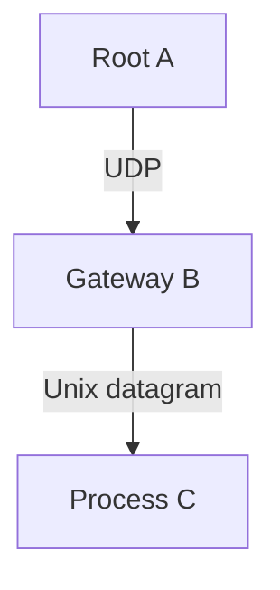

`A`, `B`, and `C` run the same node and nameserver protocol. `B` is special only
because its placement makes it a gateway.

### Bootstrap

Joining requires a `NamespaceConfig`:

```rust
struct NamespaceConfig {
    identity: ParentIdentity,
    endpoints: Vec<ParentEndpoint>,
    retry_delay: Duration,
}

enum ParentIdentity {
    Pinned(Pid),
    Discover,
}

struct ParentEndpoint {
    address: DatagramAddr,
}
```

The endpoints are alternative carrier addresses for the same authenticated
parent. A pinned configuration requires the certificate-derived PID to match.
A discovery configuration accepts the first authenticated parent that completes
the nameserver handshake, then pins that PID for all later reconnects during the
node's lifetime. The manager tries addresses in order, reconnects after failure,
and publishes connection status through a watch channel.

The child connects to the parent address using a link-local QUIC endpoint whose
CID target is PID zero. TLS still authenticates both peers by their real PIDs.
This separation allows application and control QUIC to share one physical
carrier. A fixed stream selector separates independent link-local protocols.

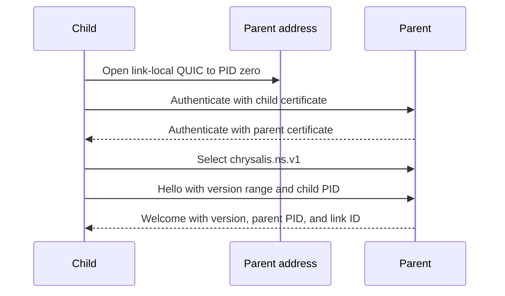

## Link-local stream protocols

`NodeConfig` registers optional link-local protocols before a node starts. Each
protocol has a stable 128-bit `LinkLocalProtocolId`; the nameserver reserves
`chrysalis.ns.v1`. Registration is immutable, duplicate identifiers are
rejected, and the nameserver identifier cannot be intercepted through the
public `Node` API.

Every stream opened through a `LinkLocalProtocol` starts with its 16-byte
protocol identifier. The receiving mux consumes that selector and delivers the
remaining opaque stream together with its TLS-authenticated source PID. An
unknown or malformed selector resets only that stream. It does not close the
pooled QUIC connection or disturb other protocols.

Each protocol has an independent bounded incoming queue. Stream classification
runs concurrently, so a protocol whose consumer is slow cannot block
nameserver traffic. QUIC still owns stream flow control, retransmission, and
connection pooling; the mux adds no message framing after the selector.

For protocols registered through `NodeConfig`, `LinkProtocolManager` supervises
one selected stream for every admitted adjacent parent or child link. The
handler receives the link context and opaque stream. Link arrival starts a
session, link departure cancels it, and reconnection creates a new session for
the new link rather than resuming the old stream.

## Nameserver

### Local state

The implemented nameserver is a singleton in-memory executor. A Tokio mutex
serializes deterministic state-machine commands, so one successful `apply` is
the local commit point.

The state machine tracks:

- admitted child links;
- one staged and one active publication per link;
- ownership of every visible PID;
- the complete local directory; and
- a monotonic authority-local revision.

A PID has one owning child link at a nameserver. A child cannot publish the
nameserver's own PID, remove another link's PID, or reuse a PID that another
link owns. One child PID may have only one admitted link at a time.

The nameserver's own `ProcEntry` is installed separately and is immutable in
version one. Visible child-directory changes advance the nameserver revision.

### Link protocol

One ordered bidirectional QUIC stream carries the complete nameserver protocol
for a parent-child relationship. Frames have a four-byte big-endian length,
one wire-version byte, one message tag, and a bounded body of at most 4 MiB.

The handshake negotiates a protocol version and binds the protocol child PID to
the transport-authenticated peer. The bootstrap sequence above shows the full
exchange; an incompatible or invalid child receives `Reject(reason)` instead of
`Welcome`.

The parent allocates a one-shot, parent-scoped `LinkId`. It admits the link
through the state-machine commit boundary before sending `Welcome`.

### Publication

A new link publishes a complete snapshot:

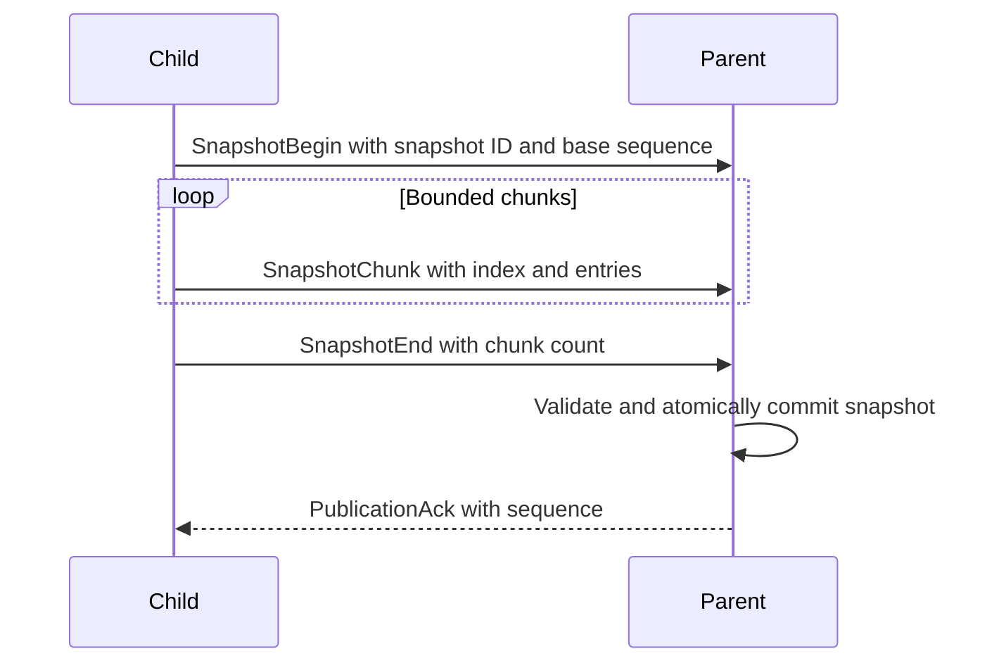

Chunks are staged and invisible until `SnapshotEnd` commits the complete
snapshot atomically. The parent sends `PublicationAck` only after commit.

Subsequent changes use contiguous deltas:

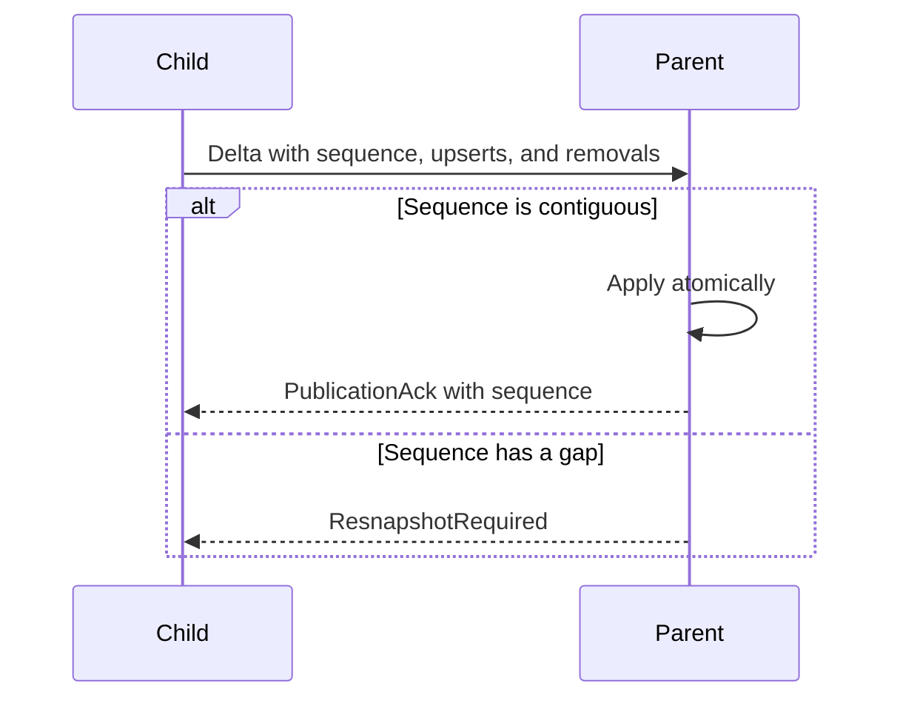

A gap produces `ResnapshotRequired`. Only one publication update is in flight
from a child at a time. This bounds ordering complexity and ensures that the
child knows exactly which complete view the parent has acknowledged.

After activation, the same stream interleaves publication with correlated
`Resolve` and `Enumerate` requests. Request IDs are scoped to the link and are
shared across query types, so one ID cannot ambiguously name two pending
operations. The protocol also defines `CacheUpdate` for an unsolicited positive
or negative resolution update; active version-one paths primarily populate the
cache from correlated resolution responses.

### Recursive aggregation

Each parent link exports:

1. the local node's own entry with its configured locators; and
2. every locally visible descendant PID, rewritten to use the local node's
   locators.

The initial export is a snapshot. Later local directory revisions trigger a
diff against the last acknowledged export and produce ordered deltas. Each
ancestor therefore learns the full PID set below a child, while each forwarding
hop stores only its locally useful next hop.

The root eventually has a global PID index. This aggregation is soft state and
need not be globally synchronized for forwarding safety.

### Deterministic replication boundary

Protocol validation and I/O are separated from deterministic commands. A
parent-side session emits commands such as `AdmitLink`, `CommitSnapshot`,
`ApplyDelta`, and `RemoveLink`; it sends a response only after an executor
returns committed effects.

The current executor applies commands under one mutex. A future replicated
executor can place consensus or another replication protocol at this boundary
without changing the link protocol or session state machine. Replication,
sharding, configuration epochs, and warm-up are not implemented in version one.

## Resolution and Enumeration

### Resolution

Resolution returns either:

```rust
Resolution::Found { entry, revision }

Resolution::NotFound {
    pid,
    revision,
    valid_for_millis,
}
```

Revisions are scoped to a nameserver authority:

```rust
struct Revision {
    authority: Pid,
    value: u64,
}
```

They order results from one nameserver incarnation; they are not a global
namespace revision.

Two consistency modes are exposed:

```rust
enum ResolveConsistency {
    Cached,
    Refresh,
}
```

`Node::resolve` first checks its locally delegated directory. A local positive
result is authoritative for that delegated entry and is returned in either
mode. On a miss, a root returns a locally revisioned negative result. A non-root
queries its current parent link.

On the parent link, `Cached` may return a live positive or negative result from
the cache. `Refresh` bypasses that link cache and performs a protocol request.
At an intermediate nameserver, an entry in its delegated local directory is
answered locally; only a local miss is forwarded farther toward the root.

Positive cache entries are revision ordered. Negative entries have a
receiver-relative deadline and do not extend their deadline when replayed.
The complete parent cache is cleared when the link closes.

Resolution supplies routing information, not a durable liveness proof. The
authenticated QUIC handshake is the final check that the requested process is
present and owns the PID.

### Enumeration

Enumeration is deterministic, PID ordered, paginated, and revision stable:

```rust
struct EnumerationCursor {
    revision: Revision,
    after: Pid,
}
```

The default page size is 256, and the maximum is 4096. A cursor is valid only
while the issuing nameserver remains at the same revision. If the revision
changes between pages, the nameserver returns `Stale`, and the caller restarts
from the first page.

`Cached` enumeration reads the receiving nameserver's coherent local view.
`Refresh` enumeration is forwarded toward the root, then rewritten on the way
back so every locator is useful to the requesting child. `Node::enumerate`
collects pages and makes up to eight complete attempts if concurrent directory
changes repeatedly invalidate its cursor.

Enumeration does not create a globally atomic snapshot across independent
nameservers. A refreshed root enumeration is a stable snapshot of the root's
currently aggregated view.

## Consistency Model

Chrysalis has three distinct consistency domains.

### Local directory consistency

Within one singleton nameserver:

- state-machine commands are serialized;
- snapshots become visible atomically;
- deltas are contiguous and atomically applied;
- acknowledgments follow the local commit point; and
- reads and enumeration pages observe one local revision.

This gives a linearizable local directory, subject to the nameserver being a
single in-memory process.

### Hierarchical aggregation

Publication toward the root is asynchronous. An ancestor may retain an entry
briefly after a lower link has failed, or may not yet contain a new descendant.
There is no global transaction or revision across the tree.

### Forwarding safety

Forwarding safety is stronger than aggregate-index freshness. Every route
learned from a child references that child's route gate. When the link fails,
the owning nameserver closes the gate before removing the session and its
entries. A stale ancestor may still route a datagram toward that nameserver,
but forwarding stops at the first dead edge.

The core invariant is:

> A nameserver forwards into a delegated subtree only while the link that
> advertised that subtree remains active.

## Liveness and Failure Handling

The nameserver stream is the lease for every entry advertised through it. There
are no independent per-entry heartbeats. Other protocols may share the same
underlying pooled QUIC connection without sharing publication lifetime.

Link-local QUIC uses:

```text
keepalive interval: 5 seconds
idle timeout:       30 seconds
```

The keepalive preserves healthy but otherwise idle control links. On a hard
disconnect, the peer receives no close frame and detects failure after the
negotiated idle timeout, or earlier if the carrier reports a definitive error.
When detection occurs, the parent:

1. closes the link's route gate;
2. commits `RemoveLink`;
3. removes every PID owned by the link;
4. removes the derived routes; and
5. republishes the resulting directory change upward.

Thus, hard-failure fencing is bounded by failure detection, currently about 30
seconds. It is not instantaneous.

On graceful shutdown, `Node` requests parent-link and QUIC shutdown, waits for
the QUIC endpoints to drain while the datagram switch remains operational, and
only then stops the switch and physical carriers. This allows FIN and QUIC
close traffic to reach the parent so publications are withdrawn promptly.

The parent-link manager reconnects indefinitely across the configured parent
addresses. Every new control stream receives a fresh link ID and republishes a
complete snapshot before it becomes active.

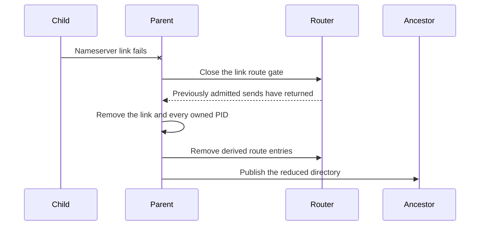

Version one strongly fences a forwarding edge, but it does not make loss of a
PID terminal. A process that reconnects with the same certificate and PID may
become reachable again. This is a known temporary limitation that Chrysalis
will correct rather than delegating incarnation fencing to its users.

The future Chrysalis contract will make PID unavailability a strong, terminal
fence. Once a PID has been fenced from the namespace, that PID will never be
admitted again. A restarted process will receive a new PID before it can rejoin,
and a broken connection to the old incarnation will never reconnect.

## Node Facade

`Node` is the common composition root. Construction starts all components:

```rust
let node = Node::create(
    NodeConfig::new(TransportConfig::new(socket, identity))
        .with_parent(namespace_config),
)?;
```

A node owns:

- its certificate-derived PID;
- one carrier-neutral, direct-UDP, or routed-UDP transport binding;
- one router and, when required, a carrier-neutral datagram switch;
- one QUIC endpoint accepting both application-PID and PID-zero traffic;
- one singleton nameserver;
- an optional reconnecting parent-link manager; and
- a child-link server and handlers for registered adjacent-link protocols.

The primary API is:

```rust
impl Node {
    fn create(config: NodeConfig) -> Result<Node, NodeError>;
    fn pid(&self) -> Pid;

    fn subscribe_parent(&self) -> Option<watch::Receiver<ParentManagerStatus>>;

    async fn resolve(
        &self,
        pid: Pid,
        consistency: ResolveConsistency,
    ) -> Result<Resolution, NodeError>;

    async fn enumerate_page(
        &self,
        cursor: Option<EnumerationCursor>,
        limit: u32,
        consistency: ResolveConsistency,
    ) -> Result<EnumerationResult, NodeError>;

    async fn enumerate(
        &self,
        consistency: ResolveConsistency,
    ) -> Result<Vec<ProcEntry>, NodeError>;

    async fn expand_pid(
        &self,
        prefix: PidPrefix,
        consistency: ResolveConsistency,
    ) -> Result<Pid, NodeError>;

    async fn dial(
        &self,
        pid: Pid,
        consistency: ResolveConsistency,
    ) -> Result<Stream, NodeError>;

    async fn accept(&self) -> Result<IncomingStream, NodeError>;

    fn shutdown(&self);
    async fn join(&self);
}
```

`Node` also exposes its nameserver, router, and application transport so users
can intercept the stack at a lower layer.

`shutdown` is idempotent and nonblocking. `join` is the structured-concurrency
boundary: it waits for parent, child, QUIC, switch, and carrier tasks to finish.
Dropping a node requests shutdown, but callers should use `join` when teardown
must be complete.

## Deployment Resolution

Deployment resolvers translate a stable deployment address into the concrete
join address, local carrier binding, and identity provider required to create a
node. They are CLI policy rather than part of the namespace protocol.

The implemented resolver is:

```text
mast://<job-name>
```

It queries MAST placement, selects the first placed task as the root, returns an
address-only UDP join locator, chooses the matching wildcard local UDP carrier,
and selects the Meta identity provider. The subsequent mTLS handshake still
authenticates the root PID. Terminal or unplaced jobs fail resolution rather
than producing a stale address.

## Replicated SQLite

`chrysalis-sqlite` demonstrates a stateful adjacent-link protocol without
adding database concepts to `Node` or the nameserver. Each parent-child link
runs one bidirectional cr-sqlite session selected by the reserved
`chrysalis.crr.v3` protocol ID.

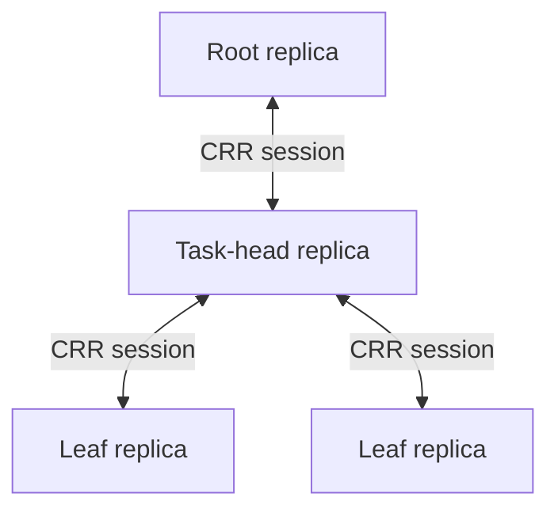

Each session exchanges schema definitions, origin scope, bounded change
batches, acknowledgments, and synchronization markers:

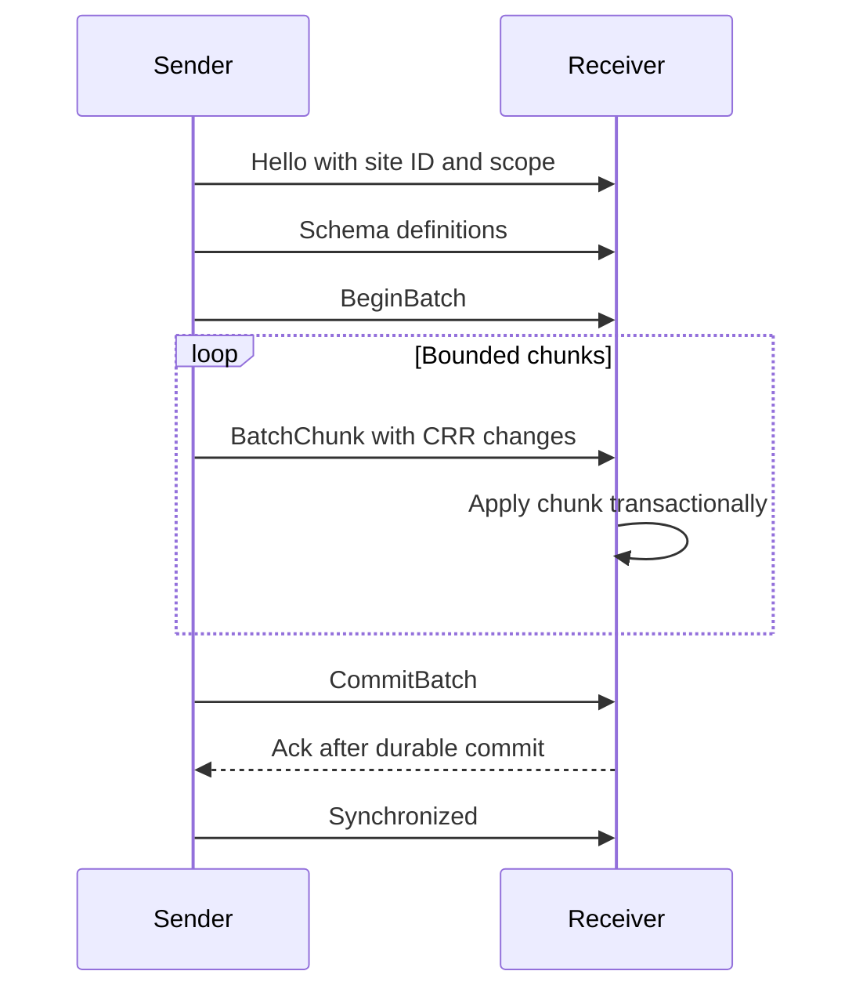

The sender retains one in-flight batch. Durable per-origin frontiers make lost
acknowledgments replay-safe and allow a later scope expansion without replaying
unrelated origins. A child advertises its finite subtree as an explicit site
set; its parent advertises the complement, so replicated changes do not loop
back toward their origin. Schema snapshots are idempotent, but conflicting
definitions terminate the session. Ordered migrations and table removal remain
out of scope.

## Scale Deployment and Experiments

`chrysalis-scale` launches real node processes in MAST. The flat topology gives
every process a UDP link to the root. The default task-head topology limits UDP
to one process per task and connects local leaves with Unix datagrams:

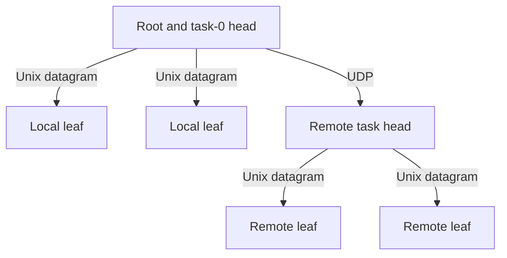

The root waits for namespace convergence and opens fresh streams to measure
join and echo behavior. Persistent mode gives every node a file-backed CRR
replica. Replicated `nodes`, `experiments`, `experiment_targets`, and `results`
tables provide discovery, durable work claiming, targeted echo or one-way
delivery tests, and result collection. Payloads stream in bounded chunks, and
measurements begin only after an untimed warmup has established pooled QUIC
connections.

## Command-Line Utility

`chrysalis-cli` installs the `chrysalis` command:

```text
chrysalis serve
chrysalis --cluster 'udp://host:port?authority=PID' serve
chrysalis --cluster udp://host:port serve
chrysalis ps mast://job
chrysalis show PID_PREFIX@mast://job
echo hello | chrysalis cat PID_PREFIX@mast://job
chrysalis sqlite repl DATABASE
chrysalis sqlite sync DATABASE
```

`serve` prints a reusable `address?authority=PID` bootstrap locator and echoes
accepted streams. Omitting `authority` explicitly requests identity discovery;
the first authenticated peer is pinned until the joining process exits. `ps`
accepts an optional cluster locator, performs refreshed enumeration, and prints
contextual locators with eight-digit PID prefixes; `ps --full` prints complete
PIDs. `show` renders one complete nameserver entry. Namespace-targeting commands
accept references of the form `PID_PREFIX[@LOCATOR]` and reject ambiguous
prefixes. A reference locator overrides `--cluster`. `cat` opens a stream to the
expanded PID, copies standard input to it, and copies the response to standard
output. Without a selected cluster, commands see only their transient local node.

The SQLite subcommands open an in-process libSQL shell, create or query CRR
databases, or keep a file-backed replica attached to the Chrysalis topology.
They use the same carrier, identity, resolver, and cluster options as the stream
commands.

Every CLI invocation is a real, short-lived node. A running `ps` or `cat` may
therefore appear transiently in enumeration. Clean shutdown withdraws it before
the process exits.

## Future Work

### Replicated nameservers

The deterministic command and commit-effect boundary is designed to admit a
replicated executor. A replicated nameserver would need one authoritative
decision about link admission, publication commit, and link removal. Serving
replicas would also need quorum-backed serving rights so a partitioned stale
replica cannot continue answering indefinitely.

Sharding, replica configuration, epoch fencing, warm-up, and shard replacement
are deferred. They belong behind the nameserver executor and configuration
interfaces, not in the datagram or QUIC layers.

### Multiple nodes per task

A scale deployment may run many independent Chrysalis nodes in one OS process
or MAST task. The Meta implementation issues a distinct Meta TLS
leaf certificate and private key for every node. Each leaf produces one PID
through the existing certificate hash, so the transport's authentication and
PID derivation do not change. The Meta QUIC identity provider encapsulates
certificate issuance, Rootcanal trust configuration, and quiche configuration;
the Chrysalis core does not depend on Meta issuance APIs.

Certificates are node-incarnation credentials, not task credentials. Two nodes
in one task must not share a leaf certificate. Replacing a node's certificate
creates a new PID, as it does today. This approach may increase issuance load
and startup latency, but it preserves standard mutual TLS verification and is
the simplest correctness baseline.

If per-node issuance becomes a bottleneck, later identity providers may use a
task certificate to authorize ephemeral node keys. Candidate designs include:

- deriving `PID = H(task_certificate, node_public_key)` and proving possession
  of the node key with a signature bound to the TLS exporter;
- presenting a self-signed node certificate with an explicit delegation
  credential signed by the task certificate's key;
- using a Chrysalis-specific child or X.509 proxy certificate with a custom
  verifier, since a normal leaf has `CA=false` and cannot issue a chain accepted
  by standard WebPKI verification; or
- using TLS delegated credentials if the QUIC TLS stack and Meta PKI deployment
  eventually support them end to end.

A random discriminator without a node key would make PIDs distinct but would
not prove possession of the subordinate identity. Any replacement scheme must
retain the current property that successful authentication proves control of
the exact PID, not merely control of a shared task credential.

### Higher-level protocols

Higher-level protocols can define envelopes, endpoint selectors, lifecycle,
supervision, and request semantics over Chrysalis streams. They should consume
the same node-to-node connectivity and process namespace rather than modifying
it. Protocols that treat connection loss as terminal process-incarnation failure
require the stronger core PID-incarnation contract described under Nodes and
PIDs.

### More general namespaces

Multiple parents, arbitrary graphs, aliases, cross-namespace federation, and
hierarchical human-readable names are not implemented. Supporting them requires
explicit loop prevention, conflict resolution, authority rules, and namespace
configuration. They should not weaken the version-one invariant that every
forwarding route has one authoritative live edge at each hop.

### Forwarding as lookup

The rooted nameserver and forwarding topologies are aligned, so a route miss
need not always require a separate lookup before sending. A node could forward
an initial QUIC datagram to its parent with a reserved CID suffix bit meaning
"the sender has not resolved the next hop." Each ancestor could either route
the datagram from its local index or continue forwarding it toward its parent.

Once an ancestor resolves the destination, its nameserver could push the
contextual route entry back down the link from which the unresolved datagram
arrived. Later datagrams would then use the installed route directly. In this
model, the first datagram acts as both traffic and a lookup request; explicit
resolution remains available when the caller needs metadata or a definitive
negative answer.

The CID bit would be a cache and forwarding hint, not proof of authority. This
optimization must retain bounded upward forwarding, prevent loops, respect
every active route gate, and define how negative resolutions suppress repeated
miss traffic.

### Path mobility

A connection is currently pinned to the path chosen when it was dialed.
`Node::dial` sorts a process entry's locators by priority and tries them in
order until one connects; nothing revisits that choice afterward. Active
migration is disabled, and the packet-I/O binding is fixed when the transport is
constructed. A connection therefore cannot fail over to another locator, and two
processes that discover they share a host cannot move from a forwarded UDP path
to a Unix datagram path without tearing down and re-authenticating.

Separating the packet path from the connection is a goal of this design, so the
connection should be the stable authenticated process-to-process object and the
path beneath it should be a replaceable attribute. There are two ways to get
there, and they differ in who owns path identity.

**QUIC-native migration** places path identity in quiche. Path validation, PMTU
probing per path, and congestion and RTT state that resets appropriately on a
path change all come for free and are already specified. The costs are that
quiche's model is one active path plus probing, driven by its own heuristics
rather than by namespace knowledge; that multipath requires an unstable
extension; and that migration requires CID rotation, which competes for the
four suffix bytes described under CID routing.

**Chrysalis-owned paths** keep quiche pinned to a stable synthetic address that
never changes, and swap the real carrier underneath it. `CarrierPacketIo`
already maintains exactly this mapping between `DatagramAddr` values and
synthetic addresses, so no migration machinery, no CID rotation, and no suffix
bits are required. Paths become a Chrysalis concept, which admits multipath,
co-location discovery, per-path policy, and integration with the contextual
locators the nameserver already computes.

The second option is more work but strictly more expressive, and it is the one
consistent with treating the packet path as independent of the connection. Its
cost is that quiche's congestion controller and RTT estimate are per-path: if
the carrier changes beneath a stable synthetic address, quiche never learns that
the path changed. Moving a connection from a 40-microsecond Unix datagram path
to a 2-millisecond cross-rack UDP path while retaining one congestion window and
RTT estimate will behave badly until it reconverges. Chrysalis-owned paths
therefore require an explicit path-change signal into quiche that resets
congestion state, which is the same information QUIC migration would have
carried. That signal is the real cost of owning path identity, and it should be
sized before either option is chosen.

### Enforced receive ownership

The carrier-neutral `DatagramSocket` contract permits at most one pending
receive operation per socket, across `poll_recv_from` and `poll_recv`. The UDP
and Unix implementations inherit this constraint from Tokio, which retains
only the most recently supplied receive waker. The in-process carrier has the
same behavior, and `DatagramSocketSet` propagates one receive poll to each of
its carriers.

The current API documents this constraint but does not enforce it:
`DatagramSocket` is shared, and both receive methods take `&self`. Concurrent
callers can therefore replace one another's wakers and leave an earlier receive
pending indefinitely.

A future API should make the receive side exclusively owned. For example, a
socket could split into a shareable send handle and a non-cloneable receive
handle whose polling methods take `&mut self`. The packet driver or socket set
would own that receive handle and remain the sole task that drains it. A
completion-owned carrier API should likewise expose either one completion
consumer or an explicit multi-consumer queue rather than silently retaining one
of several wakers.

### Completion-owned carrier buffers

The carrier-neutral `DatagramSocket::poll_recv` interface currently borrows
caller-owned payload buffers and metadata slots for one poll. A pending poll
retains neither slice. The caller presents storage again after its waker fires,
and a ready poll fills a corresponding prefix of both slices. This model is
portable, allocation-free after setup, and natural for readiness-based sockets.

Completion-driven transports can do better when the kernel or driver must own
stable buffers while operations are outstanding. A future carrier interface may
transfer an owned buffer lease into the driver and return that same lease in a
receive completion:

```rust
struct DatagramRecvCompletion {
    buffer: DatagramBuffer,
    meta: DatagramRecvMeta,
}

trait CompletionDatagramSocket {
    fn submit_recv(&self, buffer: DatagramBuffer) -> io::Result<()>;
    fn poll_recv_completion(
        &self,
        cx: &mut Context<'_>,
    ) -> Poll<io::Result<DatagramRecvCompletion>>;
}
```

The exact API may use opaque buffer IDs or pooled leases rather than the types
shown above. The important invariant is ownership: after submission, the caller
cannot access the buffer until the driver returns it exactly once through
completion or cancellation.

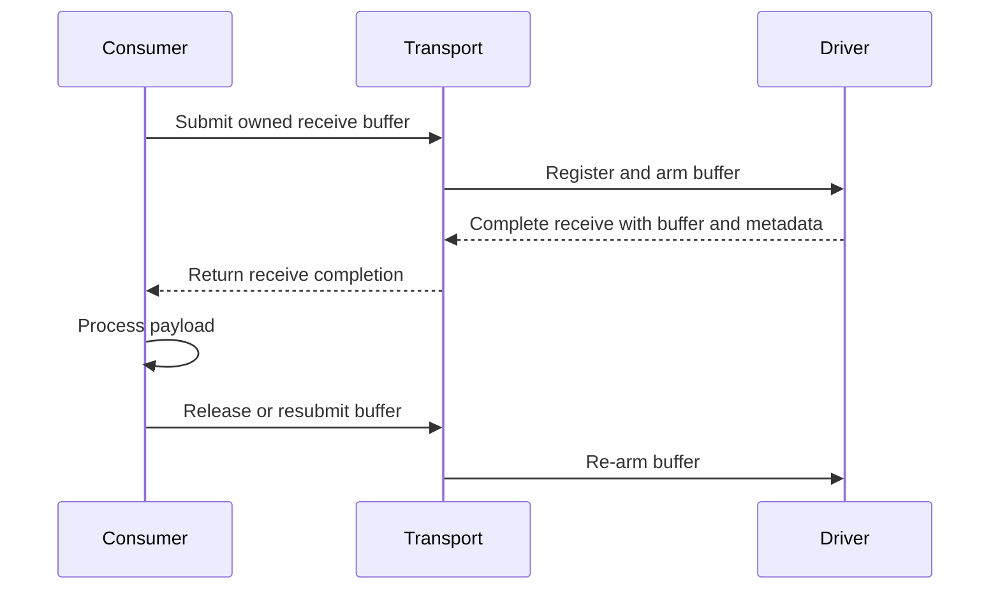

This model can preserve io_uring registered buffers across the entire receive
path, remove copies into temporary caller slices, reduce allocator pressure,
and maintain several outstanding receives without repeated setup. A completion
may represent one datagram or one GRO aggregate whose stride identifies its
constituent datagrams.

The ownership model also introduces new obligations. Buffer-pool capacity
becomes receive backpressure: a consumer that retains every completion can
starve the driver. Shutdown and cancellation must return every submitted buffer
exactly once. Routing and protocol layers must either consume borrowed views
while holding the lease or transfer the lease onward without copying. Unix and
in-process carriers need pooled adapters so the portable path keeps the same
ownership contract even when the underlying operation is readiness based.

The existing borrowed `poll_recv` API can remain as a compatibility adapter.
The completion-owned interface should first serve the packet I/O and forwarding
paths where stable buffers and copy avoidance are measurable, then replace the
borrowed path only if benchmarks justify the additional lifecycle complexity.

### Data-plane optimization

Because forwarding uses a fixed PID prefix and one gate lookup, the forwarding
table can eventually move into the kernel or eBPF. This optimization must
preserve local gate expiry and must not require stream inspection.

## Version-One Limitations

Version one intentionally has the following limits:

- one parent per node and a rooted-tree topology;
- one logical PID namespace;
- singleton, in-memory nameservers with no durable state;
- no replicated or sharded configuration service;
- immutable local process locators after node creation;
- one preferred child locator installed in the forwarding table;
- sequential locator attempts in `Node::dial`, without Happy Eyeballs;
- no application endpoint, port, RPC, or messaging abstraction;
- no terminal fencing of a reused PID;
- one built-in deployment resolver, for MAST;
- no ordered CRR schema migration or table removal;
- no authorization model beyond the embedder's TLS trust policy;
- no global linearizable absence proof or global namespace snapshot; and
- no QUIC multipath or kernel forwarding.

These are scope boundaries, not hidden guarantees. The implemented APIs expose
the lower layers needed to evolve each item independently.

## Core Invariants

The design reduces to the following invariants:

1. A PID is derived from the leaf certificate that authenticates the process.
2. Every Chrysalis QUIC CID begins with its destination PID.
3. PID zero is link-local and never globally advertised or routed.
4. Forwarders route datagrams by CID and never inspect application streams.
5. The final process authenticates the peer PID before a dial succeeds.
6. Every visible child PID at one nameserver is owned by exactly one admitted
   child link.
7. Snapshot state is invisible until atomically committed, and deltas are
   contiguous.
8. Every route derived from a child link shares that link's terminal gate.
9. Link failure fences forwarding before route and namespace cleanup complete.
10. Ancestor indexes may lag without allowing traffic to cross a fenced edge.
11. Nameserver revisions are authority-local, not global.
12. Completion credits bound transport commands and retained buffers.
13. QUIC streams are opaque bytes; link protocols, SQLite, messaging, and other
    application protocols remain higher layers.
14. Replication state learned from an adjacent peer is scoped to that link's
    lifetime and durable per-origin frontier.
15. `Node` owns task lifecycle, and `join` completes teardown in dependency
    order.
