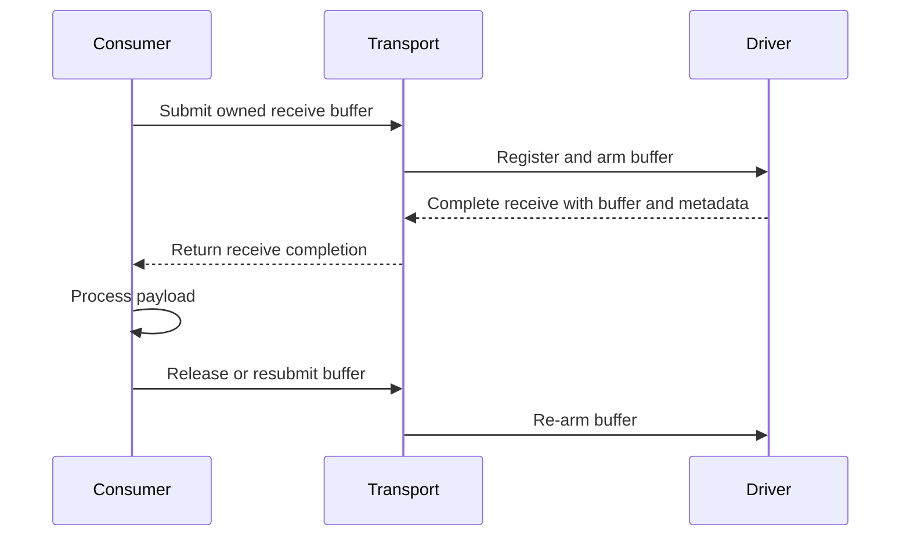

# Chrysalis Implementation Notes

This document tracks important implementation limitations and planned
optimizations that do not change the architectural contracts in
[DESIGN.md](DESIGN.md). Each item records the current cost and the constraints
that a replacement must preserve.

## Complete sends on admission, not acknowledgement

This is a defect in the public API contract rather than a tuning opportunity.

`Stream::send` resolves only when the peer has acknowledged every submitted
byte. `collect_send_completions` emits `SendOutcome::Acknowledged` once the
final `BufferLease` for the submitted range drops, which happens when quiche no
longer needs those bytes for retransmission. The idiomatic use of the API is
therefore stop-and-wait:

```rust
stream.send(first).await?;
stream.send(second).await?;
```

Each statement costs a full round trip. On a datacenter path that caps one
stream at a few tens of thousands of messages per second regardless of how many
copies the packet path avoids, so every optimization recorded in this document
is invisible next to it. The Tokio `AsyncWrite` adapter inherits the same cost,
because `poll_write` reports bytes written only after the acknowledgement
arrives. Pipelining is possible today only by holding many detached futures and
polling them together, which most callers will not do and which discards the
natural place to observe errors.

The underlying error is that one future carries two unrelated signals. Whether
the transport has taken ownership and admitted the bytes against flow control is
a backpressure question and is answered immediately. Whether the peer received
them is a delivery question and takes a round trip. `send` should answer the
first, matching the ordinary socket contract: a successful `send` means the
transport owns the data and will deliver it, not that it arrived.

The accepted point already exists in the driver. `progress_send_ops` feeds a
pending operation into `quiche::Connection::stream_send_zc` as flow control
allows, and pops it once `stream_send_zc` reports no remainder. That pop is the
moment the whole submitted range has entered quiche's stream send buffer, and
the send completion should be emitted there instead of from `send_order`.
Backpressure remains correct without any new mechanism: when
`stream_capacity` returns zero the operation stays queued, so a caller blocked
on a closed peer window waits exactly as it would on a full socket send buffer.
Partial acceptance stays invisible, because the operation is not complete until
quiche has taken the entire range, which preserves the owned-`Bytes` handoff and
keeps the API free of short writes.

Three things must not break.

Retained-byte accounting must continue to release on acknowledgement, not on
completion. The submitted allocation stays alive while quiche holds
retransmission views of it, so `SubmissionLimits::retained_send_bytes` is what
bounds memory once sends are pipelined, and it becomes the primary backpressure
signal rather than a secondary one. The budget is already tied to `RetainedBytes`
view lifetime rather than to completion delivery, so this decoupling is
available, but it must be preserved deliberately.

Graceful shutdown must stop keying on queued operations. `has_pending_operations`
finds work by scanning `send_ops` and `receive_ops`, and under the new semantics
`send_ops` empties as soon as quiche accepts a range, while that range may still
be unacknowledged and unsent. Draining would then discard data that `send`
already reported as successful. Shutdown must instead consult quiche's unsent
and unacknowledged stream state, which also interacts with the incremental
tracking described under tracking pending stream work below.

Delivery failures need a new home. Today a connection that dies before
acknowledgement surfaces as `SendAbandoned` on the send future. Once `send`
completes early, that future is gone by the time the failure is known, so the
stream must become terminally errored and report on the next `send`, `receive`,
or `finish`, exactly as a socket reports a peer reset on a later call.
`SendOutcome::Rejected` keeps its present meaning for a send submitted after the
send half began finishing.

Removing acknowledgement from the send completion removes the only transport
signal for delivery. No in-tree protocol appears to depend on it, since the
nameserver and CRR sessions both carry their own application-level
acknowledgements, but a replacement should still expose a stream-level
acknowledgement watermark for callers that need one. Do not overload `finish`
for this: `finish` also completes on acceptance today, so making it the delivery
barrier would reintroduce the same conflation one level up.

Once sends pipeline, `send_order` may collapse entirely. Ordering is preserved
by `send_ops` being drained in submission order, and abandonment only has to
complete operations that quiche has not yet accepted.

Measure messages per second and per-message latency on one stream before and
after, at one, eight, and sixty-four concurrent sends, together with retained
send bytes and the rate at which admission blocks. The expected result is that
throughput on a single stream stops tracking the round-trip time and starts
tracking the retained-byte budget.

## Wake blocked submitters instead of spinning

The submission contract is missing a direction. `SubmissionSender` exposes only
`try_send`, `try_receive`, `try_finish`, `try_discard`, `try_reset`, and
`try_stop`, and every one of them reports `WouldBlock` without any way to learn
when the condition clears. The Tokio facade therefore spins:

```rust
Err(TrySendError::WouldBlock { bytes: returned, .. }) => {
    bytes = returned;
    tokio::task::yield_now().await;
}
```

The same loop appears in `connect`, `open_stream`, `close`, `send`, `receive`,
`finish`, `discard`, `reset`, `stop`, and `shutdown`. Under sustained load,
which is the regime this transport exists for, a blocked caller becomes a task
that reschedules itself continuously. It burns a runtime worker, and because
Tokio is cooperative it also adds scheduling latency to every unrelated task
sharing that runtime. The damage is not confined to the caller that blocked.

The machinery is half-present rather than absent. `Notifier` exists, but it runs
driver to consumer: `queue::Sender::try_push` notifies so the driver wakes for
new work, and `try_pop` does not notify, so nothing wakes a producer when a
queue slot frees. `CompletionPermit::drop` does call `notify`, but on the same
notifier the completion pump waits on, so releasing a credit wakes the pump
rather than a sender waiting for that credit. `ByteBudget` has no notifier at
all, so `Reservation::drop` releases capacity silently.

Admission also already records why it refused. `SendBlockReason` distinguishes
`QueueFull`, `CompletionFull`, and `RetainedBytes`, and `ReceiveBlockReason`
distinguishes `QueueFull`, `CompletionFull`, and `PostedBytes`. The Tokio facade
discards that field and retries blindly, so the information needed to wait on
the right condition is produced and then thrown away.

Seen plainly, the completion-credit pool and the two byte budgets are counting
semaphores with no wait list, and the submission queue is a bounded channel with
no wait list. The fix is to give them wait lists with permit handoff, not to
poll them faster. The core should expose a producer-side readiness operation
alongside each `try_` method, taking a `std::task::Context` so it stays
runtime-neutral, and the Tokio facade should await that instead of yielding.

Four conditions need independent wait lists: a free submission-queue slot, a
free completion credit, retained send-byte capacity, and posted receive-byte
capacity. They must be separate, because a task blocked on retained bytes
learning nothing from a freed queue slot is the difference between one wakeup
and a wakeup per release.

Constraints a correct implementation must preserve.

Release sites must signal. That means `queue::try_pop`, `CompletionPermit::drop`,
and `Reservation::drop`, and the completion-credit signal must be separated from
the completion-available signal so the pump is not woken for every credit
release while senders continue to receive nothing.

Waking every waiter on one release is a thundering herd: `N` tasks race for one
slot and `N - 1` immediately re-park, which is the spin this item removes,
reintroduced in a more expensive form. Wake a number of waiters proportional to
the capacity actually released, or hand the released capacity directly to a
waiter.

The byte budgets are weighted rather than unit semaphores, since a reservation
is a payload length. Without FIFO fairness a large send can starve indefinitely
behind a stream of small ones. Preserve submission order among waiters on the
same budget.

Wakers must be deregistered when a future is dropped before admission, or the
wait lists grow without bound under cancellation.

Releases happen on the driver thread. Waking from inside packet processing
scatters scheduler calls through the hot loop, so collect wakeups during a
driver cycle and issue them once at the end, in the same place completions are
already flushed.

This should land before or together with completing sends on admission. That
change lets many sends from one caller be outstanding at once, which multiplies
the number of tasks that can be simultaneously blocked on admission, so the spin
gets worse before it gets better.

Measure yield iterations per admitted submission, runtime worker CPU with a
sustained backlog, admission latency percentiles, and the latency of an
unrelated task sharing the runtime. That last number is the one that shows the
collateral cost, and it is the one a benchmark measuring only transport
throughput will miss.

## Dispatch completions through slots, not hash maps

Completion delivery is a lock-protected hash-map rendezvous layered directly on
top of a lock-free bounded queue:

```rust
struct CompletionState {
    requests: Mutex<Slots<RequestId, Result<CommandResult, ()>>>,
    operations: Mutex<Slots<OperationId, Result<Completion, ()>>>,
    ...
}

struct Slots<K, V> {
    ready: HashMap<K, V>,
    waiters: HashMap<K, oneshot::Sender<V>>,
}
```

Every send, receive, finish, discard, reset, stop, open, connect, and close pays
for one `oneshot::channel` allocation, a hash insert under a `Mutex` on the
submitting task, and a hash remove under the same `Mutex` on the completion
pump, plus a cross-thread wake. The two maps exist only to resolve the race
between a completion arriving and its future registering interest.

The pump makes this a serialization point rather than merely a per-operation
tax. `pump_completions` is one Tokio task for the whole endpoint, and it
acquires those mutexes for every completion it delivers. At the message rates
this transport targets, this is plausibly the dominant per-operation cost, and
all of it sits above a queue that was made lock-free on purpose.

Identifiers should become slab handles. `OperationId` and `RequestId` are
`DriverId` plus a monotonic `u64` drawn from an `AtomicU64`, so they are dense
but never reused, and a bare `Vec` indexed by sequence would grow without bound.
Indexing modulo a fixed capacity is also unsafe: a long-lived operation can
collide with a much later one that happens to share its residue.

The bound that makes a slab work already exists. Both admission paths reserve a
completion credit immediately before allocating an identifier:

```rust
let Some(permit) = self.credits.try_acquire() else {
    return Err(TryCommandError::CompletionFull(command));
};
let sequence = self.next_request.fetch_add(1, Ordering::Relaxed);
```

`CompletionCredits` therefore already caps the number of outstanding operations
at exactly the size a slab would need. The credit and the slot are the same
resource and should be allocated together: `try_acquire` should return a permit
carrying a slot index, and the identifier should become that index paired with a
generation counter rather than a free-running sequence. Each slot holds an
`AtomicWaker` and a completion cell. The pump then performs an indexed store and
a wake, with no allocation, no hashing, and no mutex, and the arrival race
resolves the ordinary way: the pump stores before waking, and the waiter
registers before rechecking the cell.

Constraints a correct implementation must preserve.

The generation is not optional. A slot is reused as soon as its credit is
released, so a late or duplicated completion naming a stale generation must be
discarded rather than delivered to the operation that now owns the slot. This is
the same hazard that makes the current `assert!` in `Slots::register` reachable
in principle; with slot ownership carried by the receipt, two futures waiting on
one identifier becomes structurally impossible instead of a panic.

Cancellation must release a slot exactly once. A cancelled receive returns its
buffer through a completion, so the slot has to stay reserved until that
completion is delivered or the driver confirms it never will be.

Shutdown must fail every occupied slot exactly once, which today is the drain of
the two `waiters` maps in `CompletionState::stop`.

Keep the change to the per-operation path. The `establishments`, `peers`, and
`outbound` maps are keyed by connection rather than by operation, so their rate
is orders of magnitude lower and a map remains the right structure.

The pump's common path also stops needing to be asynchronous. Only the incoming
stream branch awaits a channel send; every other completion becomes an indexed
store and a wake.

This composes with sharding the endpoint. Slots are per-driver, so each shard
owns its own slab and its own pump with no cross-shard coordination, and the
pump becomes cheap enough that per-shard pumps are affordable.

Measure per-operation dispatch cost, allocations per operation, mutex contention
on the pump, and completion delivery latency at one, eight, and sixty-four
concurrent operations. The expected result is that dispatch cost stops varying
with the number of in-flight operations.

## Check the connection pool before resolving in `Node::dial`

`Node::dial` resolves unconditionally before it reaches the transport:

```rust
let Resolution::Found { entry, .. } = self.resolve(pid, consistency).await? else {
    return Err(NodeError::NotFound { pid });
};
```

The pooled-connection check lives inside `QuicTransport::dial_with_server_name`,
which runs only after that resolution returns. Opening a second stream to a peer
this node is already connected to therefore pays for a namespace lookup it
cannot use.

The cost is not just an extra await. `Nameserver::resolve` takes the state mutex
that serializes every state-machine command, so each stream open contends with
publications, deltas, and link admission on one lock. With
`ResolveConsistency::Refresh` it is worse: the request is forwarded toward the
root, so opening a stream over a warm connection can cost a network round trip
to another machine. Each call also clones the entry's locator vector, sorts it,
and clones the server name per attempt.

This contradicts the claim in [DESIGN.md](DESIGN.md) that opening each
additional stream is 0-RTT and requires no new connection setup. That is true of
`QuicTransport` and false of `Node`, which is the facade nearly every caller
uses.

Pool-first is safe, and specifically safe here because identity is
certificate-derived. A live pooled connection is by construction to a process
that authenticated as that PID, so resolution cannot discover that the
connection points at the wrong process. The only thing it could discover is
unreachability, which the connection reports on its own, and the existing
fallback already handles a dead pooled entry by opening a new connection. So
resolution adds nothing on the pooled path.

`QuicTransport` should expose the pool probe separately from dialing, so
`Node::dial` can attempt a pooled open first and resolve only on a miss.

The signature should change with it. `consistency` has no meaning once a
connection is pooled, so the parameter promises a choice the function may
silently ignore. Splitting the operation into a pooled-then-resolving `dial(pid)`
and an explicit `dial_at(pid, locator)` makes the behaviour visible, and
`resolve(pid, consistency)` remains available for callers that want fresh
locators, fresh metadata, or a definitive negative answer.

Constraints a correct implementation must preserve. A pooled connection that
fails to open a stream must still fall through to resolution and redial.
`Refresh` must remain reachable as an explicit operation. On the miss path,
locator priority order and sequential fallback must behave as they do today.

Two adjacent problems are worth fixing in the same pass. Concurrent dials to an
unpooled PID each resolve and each establish a connection, and the pool insert
overwrites, so the loser is never reused and never closed; coalescing concurrent
dials for one PID behind a single shared attempt belongs in the same code.
`Node::expand_pid` also enumerates the entire visible directory in order to
expand a prefix, which is acceptable for the CLI callers it has today but is the
same shape of oversight.

Measure stream-open latency and allocations for a pooled peer under both
consistency modes, and nameserver state-mutex contention while streams are being
opened. The expected result is that opening a stream to a connected peer stops
touching the nameserver at all.

## Remove the two receive-side stream copies

The steady-state receive path copies each payload byte twice above the kernel
boundary. `BufferFactory::buf_from_slice` copies retained STREAM data out of the
receive slot into quiche's reassembly storage with `Bytes::copy_from_slice`, and
`stream_recv` copies it again from reassembly into the caller's posted
`BytesMut`. Neither copy is required by QUIC.

The first exists only because decryption writes its output back where it found
it. quiche decrypts in place inside the receive slot, and the slot is recycled
as soon as `Connection::recv` returns, so anything that must outlive the call
has to be copied somewhere durable first.

Decrypting out of place removes that copy rather than relocating it. If AEAD
reads from the receive slot and writes into a transport-owned pooled buffer,
decryption has already placed the plaintext in storage that outlives the slot,
and there is nothing left to copy into reassembly. It is also cheaper in memory
traffic and not merely in passes: decrypt-in-place followed by a copy is two
read passes and two write passes over the payload, while an out-of-place decrypt
is one of each.

Removing the second copy then needs a `stream_recv` variant that returns
quiche's `F::Buf` rather than filling a caller buffer, plus an owned receive API
above it. This part is closer than it appears, because `QuicheBuffer` already
holds received data as `Storage::Internal(Bytes)`, so handing it to the
application is a move.

Together these give a receive path with no payload copy after decryption, and
they also remove the requirement that callers pre-post buffers they must size
blindly: `STREAM_RECEIVE_CAPACITY` is a hardcoded 64 KiB per stream on the
`AsyncRead` path, and the endpoint permits 16,384 concurrent streams.

Decryption cannot write directly into the application's posted buffer, and it is
worth recording why so the idea is not revisited. Header protection must be
removed before the packet number is known, AEAD then covers the whole packet
payload as a single unit under one tag, and only after decrypting can frames be
parsed to discover which stream the bytes belong to. One packet may carry STREAM
frames for several streams alongside ACK and other control frames, so the
destination is not knowable at decrypt time, and AEAD output cannot be split
across destinations.

Two costs remain. Per-packet pooled buffers churn the allocator, so they want a
pool with an explicit retention budget, where exhaustion degrades the retaining
application rather than the receive ring. And ordered stream bytes can span
several buffers, so an owned receive returns a sequence of `Bytes` rather than
one contiguous allocation; callers that need contiguity opt back into a copy
explicitly, at the point that needs it. That consequence is common to every
zero-copy variant.

Reference-counted receive slots were considered as the alternative and should
not be pursued. Making the slot itself the retained buffer, so `buf_from_slice`
becomes a `slice_ref`, reaches the same zero copies but keeps application code
holding views into the driver's receive ring. Under GRO a slot holds many
datagrams, and on a forwarding path those belong to different connections, so
one stalled reader pins bytes belonging to unrelated peers. It also requires a
budget separating application retention from the driver's own pool, because
retention that can empty the pool produces kernel drops rather than
backpressure, and a compaction path that copies survivors out of a slot pinned
past a threshold, without which pinning is unbounded in time. Out-of-place
decryption reaches the same copy count with none of this: the retained unit is
one packet rather than one aggregate, so it never spans connections, and it is
transport-owned storage handed over as an owned value rather than a borrowed
view into the ring.

This is distinct from the arena work in `IOARENA.md`, which concerns the
gateway-to-process boundary, but the two are complementary: that design has each
process decrypt in place, and these stream-level copies sit immediately above
decryption and would otherwise absorb much of its benefit. If out-of-place
decryption lands, the arena's ingress slot becomes the AEAD source rather than
storage that must be retained.

### Pooled send buffers

The send side already treats its transform as the materialization: encryption
writes header, ciphertext, and tag straight into a transmit slot, with no
plaintext staging in between. Out-of-place decryption is the receive-side
equivalent, and restores the symmetry between the two directions.

Pooled buffers apply on the send side too, with a different payoff that is worth
stating precisely. On the owned-`Bytes` path there is already no pre-encryption
copy, so pooled send buffers remove no row from the copy ledger.
What they remove is the per-message allocation and free, whose lifetime is
determined by acknowledgement rather than by the caller, which is the pattern
that fragments a general-purpose allocator. They also remove the `AsyncWrite`
copy, which exists only because a borrowed slice must be retained past
`poll_write`. Most usefully, they let a caller serialize a message directly into
transport-owned storage instead of materializing it somewhere else first.

This needs no new submission shape. `bytes` supports owner-backed construction,
so the transport can hand out pool-backed `BytesMut`, the caller writes and
freezes it, and the existing `send(Bytes)` accepts the result unchanged;
`RetainedBytes` and `QuicheBuffer` already carry `Bytes` with a lease, so
retention accounting works as it does today.

One thing to keep in view: buffer acquisition becomes a new blocking point,
because a caller now waits for storage before it has data rather than receiving
its data back at admission, which makes this dependent on the producer-side
wakeup path described above.

Pools on both sides would let the transport own one allocation source, and the
three current budgets covering queue slots, retained send bytes, and posted
receive bytes could collapse into pool occupancy. That is worth evaluating once
both sides exist, not a precondition for either.

Measure copies and memory-traffic passes per received byte, decrypt-buffer pool
occupancy and retention age, allocation rate per message on send, and throughput
and tail latency with one deliberately stalled reader. The stalled reader is the
important case: it must degrade itself and nothing else, and it is the property
that out-of-place decryption buys over reference-counted receive slots.

## Partition bounded resources by fault domain

Every bounded resource in the transport is bounded globally and shared by every
peer. One endpoint has one 4,096-entry submission queue, one 8,192-entry
completion queue, one 256 MiB retained-send budget, one 256 MiB posted-receive
budget, and one 8,192-slot incoming-stream channel, and no peer has a claim on
any of them.

The design principle this misses is that bounded shared resources should be
partitioned by fault domain, which here means by peer, rather than merely
bounded in aggregate. The invariant recorded in [DESIGN.md](DESIGN.md) that
completion credits bound transport commands and retained buffers is a statement
about memory safety. It says nothing about availability, and the two are being
treated as the same property.

The most severe consequence is a total endpoint stall. `pump_completions`
delivers every completion for the endpoint and calls `CompletionState::process`,
which for an incoming stream awaits a send on the bounded incoming channel:

```rust
tokio::select! {
    _ = sender.send(accepted) => {}
    () = self.acceptance_stopped() => {}
}
```

When that channel is full the pump blocks, and no completion of any kind is
delivered for any connection until the application accepts or acceptance stops.
One peer opening streams faster than the application accepts them therefore
halts every send, receive, connect, and close on the endpoint. The channel holds
8,192 streams while `DEFAULT_STREAM_LIMIT` permits 16,384 per connection, so a
single peer can fill it without reaching its own stream limit.

Two milder versions of the same defect follow. An accepted-but-unconsumed stream
retains a `LeasedCompletion`, so unaccepted streams pin completion credits from
the pool that sends and receives also draw on. And a peer that stops
acknowledging holds retained send bytes until the idle timeout expires; with a
64 MiB flow window against a 256 MiB budget, four such peers exhaust it and
block sends to healthy peers for the ~30 seconds detection takes.

Two changes are wanted, and they are independent.

The structural one is that the completion pump must never wait on application
progress. Acceptance backpressure belongs per connection: hold incoming streams
in a per-connection queue and move them into the shared accept queue only when
there is room, so a peer that outruns the application fills its own queue and
nobody else's. When that per-connection queue is also full, refuse the stream
with a reset rather than propagating the stall upward, which is the behaviour
QUIC already expects. Incoming-stream acceptance should also draw on its own
credit class, so a stream flood cannot consume the budget that data-plane
operations need. That much is worth doing even if nothing else here is.

The general one is per-peer sub-budgets carved from each global pool: a small
reserved floor per peer plus a shared overflow pool. The floor guarantees a
misbehaving peer cannot reduce any other peer to zero, the overflow preserves
the efficiency of a single large pool for the common case where one peer is
legitimately busy, and the global bound stays exactly as it is today.

Constraints a correct implementation must preserve. The aggregate bound must
remain exact, so floors are carved from the pool rather than added to it, and
the number of peers times the floor must fit. Floors must be reclaimed when a
peer disconnects or goes idle, or a long-lived process accumulates reservations
for peers it no longer talks to. The overflow pool needs an allocation policy,
since first-come-first-served lets one peer hold all of it indefinitely and
reproduces the current behaviour above the floors. Per-peer accounting must stay
off the hot path, which means counters owned by the connection rather than a
shared map keyed by PID.

Sharding the endpoint reduces the blast radius of the pump stall to one shard
but does not remove it, and per-shard pools make the floor arithmetic
per-shard rather than per-endpoint. The two should be designed together.

Measure this with a deliberately misbehaving peer rather than in aggregate: hold
one peer's accept loop, or stop acknowledging on one connection, and measure
completion delivery latency and throughput for an unrelated peer on the same
endpoint. Aggregate throughput will look healthy in exactly the cases this item
is about.

## Separate control traffic from bulk traffic on shared connections

The link-local mux gives each registered protocol an independent bounded
incoming queue, so a slow consumer of one protocol cannot block classification
of another. That protection stops at the mux. The nameserver protocol and the
CRR session share one pooled QUIC connection to the parent, so they also share
one congestion window, one pacer, and one connection-level flow-control window,
and nothing below the mux distinguishes them.

`stream_priority` is never called anywhere in the transport, so every stream
runs at quiche's default urgency. The same gap exists on the application
transport: latency-sensitive request traffic and bulk transfer share a
congestion window with no way to say which is which.

Two distinct problems follow, and they need different mechanisms.

Sharing congestion state couples control latency to bulk behaviour. A large CRR
batch drives the connection into loss recovery, and the nameserver stream then
inherits the collapsed window and inflated round-trip estimate. Namespace
resolution slows down exactly when a node is busiest, and because `Node::dial`
resolves on every stream open, that lands on the application fast path.

Sharing flow control is the sharper problem. `QuicConfig` sets
`initial_max_data` and `initial_max_stream_data_bidi_remote` from one
`flow_window` value, both 64 MiB by default, and the link-local transport uses
the same defaults. A single stream can therefore consume the entire
connection-level window. If the CRR session's reader is slow, the connection
window is exhausted and the nameserver stream cannot send at all.

Unlike congestion, this does not resolve on its own. It clears only when the
peer application reads, and while it persists the connection is not idle:
acknowledgements and keepalives continue, so the idle timeout does not fire and
no failure is detected. The link stays up while the control protocol is wedged,
which is worse than a detected failure because nothing reacts to it.

Three changes, in increasing order of cost.

Give each stream a priority at open and dial, mapping to quiche's
`stream_priority`. This is a transport scheduling hint rather than an
application envelope, so it does not weaken the rule that streams carry opaque
bytes, and it must stay out of the wire format for the same reason. Pin the
nameserver protocol to the highest urgency.

Make the per-stream flow-control window a fraction of the connection window
rather than equal to it, so no single stream can consume all connection-level
credit. This is the part that actually prevents the starvation above: priority
schedules among streams that *can* send, and a stream blocked on connection-level
flow control cannot send at any urgency. Priority and window sizing solve
different halves and neither substitutes for the other.

Consider a separate physical connection for control and bulk on parent links.
It removes the coupling class entirely rather than managing it, at the cost of
one extra handshake per link and a second keepalive, which is worth weighing
against node density in a scale deployment.

Constraints a correct implementation must preserve. Per-stream windows must stay
large enough to cover the bandwidth-delay product, or bulk throughput pays for
the isolation. Priority must not influence routing, identity, or anything a
forwarder observes. And a reserved floor for the nameserver must survive
reconnection, since a new link creates a new stream.

Measure nameserver resolve and publish latency while a bulk CRR batch saturates
the same parent link, and separately with a deliberately slow CRR reader, which
is the flow-control case rather than the congestion case. The second experiment
is the one that distinguishes a working fix from a partial one.

## Fence on carrier liveness signals instead of waiting for the idle timeout

Hard-failure fencing is bounded by QUIC idle-timeout detection, roughly thirty
seconds by default. Until it fires, the parent keeps advertising the dead
child's PIDs upward and the router keeps forwarding into a dead next hop. For a
system whose model is that stream liveness is process liveness, that is a weak
liveness signal.

Most of these failures are observable locally and immediately, and the
forwarding plane already sees some of the evidence. `Router::forward` returns
definitive send errors to its caller, distinguishing them from `WouldBlock`, and
nothing turns them into a liveness decision.

The two concepts the system currently fuses should be separated. Unreachability
is fast evidence gathered from carriers and the forwarding plane. Withdrawal is
authoritative namespace state that propagates upward. Unreachability is a signal
rather than a proof, and policy decides whether to act on it by cutting a link.

Signal sources differ in how much they can be trusted, and the policy must
differ with them:

- A local process exit observed through `pidfd` is authoritative. It needs the
  peer's OS process id, which a child can publish as a label using the existing
  label mechanism.
- A Unix datagram send failing with `ENOENT` or `ECONNREFUSED` is authoritative
  for that socket, subject to a peer that may rebind the same path.
- An in-process endpoint that has gone away is authoritative by construction.
- ICMP port-unreachable is neither authenticated nor hard to inject off-path,
  and QUIC deliberately declines to treat it as proof. It must never fence on
  its own.
- Repeated egress failure without progress is weak aggregate evidence.

The constraint that shapes this is that `RouteGate::close` is terminal. There is
no reopen, so acting on a signal is not a probationary fence: it is equivalent
to cutting the link. Either act only on authoritative signals, or introduce a
reversible suppression state that is distinct from the terminal gate. The first
is simpler and should be preferred.

Cutting on a false positive is recoverable but not cheap. The link manager
already reconnects indefinitely and republishes a complete snapshot on a fresh
link, so the failure mode is churn rather than a permanent outage. The churn is
proportional to the subtree, because teardown removes every descendant PID and
republishes upward and reconnection republishes all of it again, which
compounds the full-directory rebuild described below. That cost is the argument
for not acting on unauthenticated evidence.

Unauthenticated signals should instead trigger accelerated verification: send an
ack-eliciting probe and apply a short timeout, so a real failure is confirmed
within a round trip or two rather than thirty seconds. That captures most of the
latency benefit with none of the spoofing exposure.

Independently, the link-local transport inherits the general default idle
timeout. Control links are cheap and already carry keepalives, so a shorter
timeout there is affordable and reduces the worst case when no better signal
exists.

The mechanism should be a liveness-source hook that a carrier can supply,
delivering classified signals to the parent-link manager. Classification belongs
to the carrier, which knows what it observed; policy belongs to the link
manager, which knows what a cut costs.

Constraints a correct implementation must preserve. Only the owning nameserver
may fence a link. The existing ordering must not change: the gate closes before
routes and namespace entries are removed, so no datagram crosses a fenced edge
during cleanup. A cut link must still receive a fresh link ID and republish a
complete snapshot on reconnect.

Measure time from process termination to gate close and to withdrawal at the
grandparent, separately per carrier, along with the false-positive rate of each
signal source and the republication cost of one spurious cut on a large
subtree.

## Make the residual forwarder parallel and lock-free

`UDP_DELEGATION.md` removes the forwarder from the steady-state path wherever a
process can obtain its own reachable socket, directly or through recursive
parent-assisted acquisition. It deliberately keeps recursive CID forwarding as
the fallback for containers where descriptor transfer, reachability, ports, or
host policy prevent an additional path. This item is about that residual
forwarder, which stays on the critical path for exactly the environments that
have no alternative.

Today it is one Tokio task draining the switch. Each datagram takes a read on a
`RwLock<HashMap<Pid, Route>>` for the route lookup and then a
`Mutex<RouteGateState>` to admit the send, with a second acquisition to release
it. The gate mutex is the more serious of the two: it is a real mutex taken
twice per forwarded datagram, and `RouteGate::close` holds it while waiting on a
condition variable for in-flight sends to drain.

Forwarding parallelizes far more easily than an endpoint does, because it is
stateless apart from the gate check, and two consequences follow that do not
hold for endpoint sharding.

Steering does not have to be exact. Any shard can forward any datagram
correctly, so a datagram delivered to the wrong shard is merely handled by that
shard. This removes the GRO hazard that makes reuseport steering questionable
for endpoints: an aggregate spanning several destination CIDs is harmless here,
because whichever shard receives it splits it and routes each segment. Reuseport
sharding is therefore appropriate for the forwarder even if it is rejected for
endpoints.

Because misdelivery is harmless, the route table should stay shared rather than
partitioned per shard. Partitioning would require exact steering, reintroduce
the GRO hazard for no benefit, and complicate route installation. Replace the
`RwLock<HashMap<Pid, Route>>` with an `ArcSwap` so that reads on the packet path
take no lock at all, and keep every shard reading the same table.

A forwarder also does not need the nameserver to publish anything for steering.
At an endpoint the destination PID prefix is constant, which is why endpoint
steering has to read the CID suffix. At a forwarder the prefix is the descendant
being addressed, so it already varies, and a classic BPF program can mask bytes
of the prefix directly. Publishing an explicit shard assignment would only be
needed to control which descendant lands on which shard rather than accepting
the distribution a hash of the PID gives, and PID bytes are uniformly
distributed because the PID is a certificate hash.

Prefer prefix steering over the conventional `SKF_AD_CPU` program for two
reasons. A gateway usually receives an upstream peer's traffic over one
four-tuple, so CPU steering follows one receive queue and yields no parallelism
for that peer at all. Prefix steering is also stable per destination, which
keeps one connection's datagrams on one shard and avoids reordering that would
trigger spurious loss detection at the endpoints.

The gate must stop being a mutex before any of this helps. Admission and release
should become atomic operations on a packed state word holding the active flag
and the in-flight count, with `close` clearing the flag and then waiting for the
count to reach zero. The existing contract must survive unchanged: after `close`
returns, no route derived from the dead link may begin another send, and every
admitted send has returned.

Finally, a forwarder can recover GSO that it currently gives up. Consecutive
datagrams in a received aggregate have different destinations, but the segments
sharing a destination can be regrouped and sent as one aggregate to that next
hop. This is the same per-destination batching `IOARENA.md` describes for the
arena path, and it applies equally to the ordinary Unix datagram and UDP
forwarder.

Measure forwarded datagrams per second per shard, gate admission cost, route
lookup cost, shard imbalance, and reordering observed at the endpoints, with the
forwarder as the deliberate bottleneck rather than the endpoints.

## Make the UDP payload size a discoverable per-path property

`DEFAULT_MAX_UDP_PAYLOAD_SIZE` is 1,472, which is the IPv4-tuned value: 1,472
plus a 20-byte IPv4 header and an 8-byte UDP header is exactly 1,500. Chrysalis
deploys over IPv6, where the resolver's default carrier is `udp://[::]:0` and
the scale runner and CLI both bind IPv6 wildcards. On IPv6 the same payload
produces a 1,520-byte packet, which exceeds a 1,500-byte path.

That the system works today therefore says the deployed path MTU is larger than
1,520, not that the constant is right. The constant is IPv4 arithmetic applied
to an IPv6 deployment, and the interesting consequence is the opposite of a bug:
if the fleet runs a large MTU, the transport is claiming 1,472 bytes of it. On a
9,000-byte path that leaves roughly six times the per-packet overhead unclaimed,
and since GSO is already in place, taking it is close to free for bulk transfer.

The constant is also structural rather than merely mistuned.
`QuicConfig::udp_driver_config` derives the GSO segment size from it when the
driver is constructed, and the same value is given to quiche as both
`set_max_send_udp_payload_size` and `set_max_recv_udp_payload_size`. Nothing can
adapt afterwards: path MTU discovery cannot raise it and a path MTU signal
cannot lower it.

Make it discoverable and per path. The driver needs a segment size that can
change at runtime, which means transmit slots sized for the maximum rather than
for the current segment size. GSO requires equal-sized segments within one
aggregate, so a change takes effect at the next aggregate rather than inside
one. Receive slots are already 65,535 bytes, so GRO is unaffected.

Establish the actual path MTU on the target fleet before changing the constant,
and measure throughput at the current value against the discovered one. If the
fleet MTU is large, this is likely the cheapest throughput available anywhere in
this document.

## Size stream flow control against the connection window and peer count

`QuicConfig` derives `initial_max_data`, `initial_max_stream_data_bidi_local`,
`initial_max_stream_data_bidi_remote`, `set_max_connection_window`, and
`set_max_stream_window` from one 64 MiB `flow_window`, and permits 16,384
concurrent streams.

Because the per-stream window equals the connection window, it is not a limit at
all: one stream may consume every byte of connection-level credit. There is no
intra-connection fairness beyond quiche's default scheduling, and the starvation
consequence is covered above under separating control traffic from bulk traffic.

The memory consequence is separate and is not covered there. Receive-side
reassembly storage is bounded by the connection window, so it can reach 64 MiB
per connection, and the real bound is that figure times the number of peers.
This is a second receive-memory pool that the posted-receive budget does not
cover: `SubmissionLimits` bounds the `BytesMut` buffers an application posts,
not the storage quiche holds beneath them. Only one of the two pools has a
global bound today.

Set the per-stream window to a fraction of the connection window, and size the
connection window against the peer count a node expects rather than in
isolation. Bounding aggregate reassembly by admitting connection windows from a
shared pool would close the gap properly, and belongs with the per-peer
partitioning described above.

## Decouple the completion core from Chrysalis identity, or narrow the claim

`DESIGN.md` states that each layer is independently useful. That is true of the
carriers, the router, and the nameserver, and overstated for the completion
core. `chrysalis-transport-quiche` depends on `chrysalis-core` for `Pid` and
`RoutedCid`, `EndpointIdentity::from_leaf_certificate` puts PID derivation
inside the QUIC layer, `Endpoint` is constructed with a routing PID, and
`Completion` is a closed enum over Chrysalis's own operation set. The core is
reusable as a QUIC driver for Chrysalis; it is not reusable as a general
completion transport by an embedder with a different identity scheme.

Genuine neutrality would mean parameterizing the driver over a routing-tag type
rather than `Pid`, and making the completion type extensible rather than closed.
That is real work with an unclear consumer, and should not be done
speculatively. The cheaper and more honest fix is to narrow the sentence in
`DESIGN.md` to say which layers are reusable and in what sense.

This is a different axis from the runtime neutrality described under making the
complete stack completion-oriented: that item removes the Tokio dependency, this
one concerns the identity dependency, and neither implies the other.

## Build TLS configuration once per driver

`QuicConfig::build` is called twice per transport, once for the client
configuration and once for the server configuration, and a `Node` owns one
transport. Each call constructs three `PemFile` values, so a node performs six
`memfd_create` and write operations and has BoringSSL parse the certificate
chain, private key, and trust roots twice.

At one node per process this is small. It grows linearly if several nodes share
a process, which is the direction the multiple-nodes-per-task work in `DESIGN.md`
points, and the trust-root bundle is the expensive part to parse.

Each `PemFile` exposes its contents at `/proc/self/fd/N` for quiche to open.
The exposure is transient, since the files live only for the duration of
`build`, but private key material does transit a path visible to any process
that can read this process's `/proc` entry, and reducing the number of times
that happens is worthwhile on its own.

There is a constraint on how far this can be shared. quiche takes `&mut Config`
when creating and accepting connections, so a single configuration shared across
sharded endpoints would serialize handshakes behind a mutex. The right unit is
therefore one configuration pair per driver thread rather than one per process.
Sharing the parsed material instead of the configuration object would avoid the
tradeoff but requires quiche support that does not exist today.

Measure the share of node startup attributable to configuration construction
before changing this, and measure it again at the node density the
multiple-nodes-per-task work assumes.

## Index runnable and timed QUIC connections

`Network::queue_packets` currently scans every live connection during each
packet-generation pass:

```rust
loop {
    let mut progressed = false;
    for (connection_id, state) in &mut self.connections {
        if self.failed_connections.contains(connection_id) {
            continue;
        }
        // Ask quiche for one GSO aggregate from this connection.
    }
    if !progressed {
        return Ok(());
    }
}
```

See
[`Network::queue_packets`](https://www.internalfb.com/code/fbsource/[D117242766-V33]/fbcode/monarch/chrysalis-transport-quiche/src/driver/network.rs?lines=375).

This is acceptable for the initial implementation because it is simple and
round-robins productive connections one aggregate at a time. Its cost is linear
in all live connections, however, even when only a few have packets ready. If
packet generation requires several passes, the cost is `O(connections ×
passes)`. Large mostly idle connection sets will therefore spend increasing CPU
time asking quiche connections that immediately return `quiche::Error::Done`.

A future scheduler should maintain a deduplicated queue of connections that may
produce packets. A connection becomes runnable after:

- receiving a packet that may require acknowledgements or handshake output;
- accepting application stream or connection-control work;
- reaching a QUIC timeout or pacing deadline; or
- entering a close or failure transition that must emit protocol output.

Each dequeue should allow one bounded GSO aggregate before moving a still-ready
connection to the back of the queue. This preserves the current fairness across
connections and the existing packet-slot bound. Failed or reclaimed connections
must be removed without leaving stale queue entries, and pacing deadlines must
not cause busy polling.

Before replacing the scan, measure connections examined, connections producing
packets, generated datagrams, and driver-cycle CPU time at representative idle
and active connection counts.

Packet generation is not the only connection-wide work in one endpoint cycle.
`Endpoint::poll` calls `Network::progress` twice, and each call visits every
connection. The cycle also scans all connections to find the earliest timeout,
fire expired timers, and find closed connections. See
[`Endpoint::poll`](https://www.internalfb.com/code/fbsource/[D117242766-V33]/fbcode/monarch/chrysalis-transport-quiche/src/driver.rs?lines=739),
[`Network::progress`](https://www.internalfb.com/code/fbsource/[D117242766-V33]/fbcode/monarch/chrysalis-transport-quiche/src/driver/network.rs?lines=356),
[`Network::next_timeout`](https://www.internalfb.com/code/fbsource/[D117242766-V33]/fbcode/monarch/chrysalis-transport-quiche/src/driver/network.rs?lines=452),
[`Network::process_timeouts`](https://www.internalfb.com/code/fbsource/[D117242766-V33]/fbcode/monarch/chrysalis-transport-quiche/src/driver/network.rs?lines=459),
and
[`Network::reap_closed`](https://www.internalfb.com/code/fbsource/[D117242766-V33]/fbcode/monarch/chrysalis-transport-quiche/src/driver/network.rs?lines=471).

These scans make an otherwise idle driver cycle `O(connections)`. The
connection scheduler should therefore track more than packet writability:

- a deduplicated ready queue for connections whose protocol or stream state may
  advance;
- a deadline heap with generation numbers for QUIC timers and pacing deadlines;
  and
- an explicit queue of failed or closed connections awaiting reclamation.

Receiving a packet and accepting application work already identify the affected
connection directly. Those paths should mark that connection ready instead of
requiring the next driver cycle to rediscover it through a full scan.

## Shard one endpoint across driver threads

Indexing runnable connections makes one driver cycle cheaper. It does not raise
the ceiling, because an endpoint has exactly one driver thread. That thread
drains submissions, advances every runnable connection, performs AEAD
encryption and decryption for every packet, assembles packets, submits and reaps
io_uring operations, fires QUIC timers, and stages completions.
`spawn_direct_udp_with_config` is therefore both the lowest-overhead constructor
and the least scalable configuration: its throughput is bounded by one core's
crypto and packet-assembly rate no matter how many copies the path avoids.

The endpoint should be able to run as `N` shards, with one `UdpDriver`, one
`Endpoint`, and one driver thread per shard, and with each datagram reaching the
shard that owns its connection. Steering must be exact rather than statistical:
quiche connection state is single-owner, so a connection has to reach the same
shard for its whole life.

Two designs achieve that, and they differ in whether the shard is hidden inside
the CID or published as a locator. The first keeps one bound address and asks
the kernel to demultiplex; the second gives each shard its own address and lets
the dialer choose. Sharding applies to the application transport; the
link-local endpoint carries control traffic and can remain single-shard on the
primary address.

### Option one: one address, reuseport steering on the CID suffix

Steering must read the CID suffix, not the PID prefix. Every datagram arriving
at this node carries this node's own PID in the prefix, so a prefix hash sends
all inbound traffic to one shard. Only the four-byte suffix varies between
connections.

`RoutedCid` already writes that suffix as a big-endian `u32` after the sixteen
PID bytes, and it is either an endpoint-issued `ConnectionKey` or a
client-chosen `InitialNonce`. Reserving the low `k` bits of the suffix for a
shard index makes steering a masked load:

```text
suffix = [connection key or nonce: 32 - k bits][shard index: k bits]
```

Each shard allocates `ConnectionKey` values that carry its own index, so every
CID a shard issues steers back to it. Outbound connections choose their own
source CID, so the dialing shard selects itself. Inbound Initial packets carry a
client-chosen `InitialNonce` whose low bits are random, so new connections
distribute across shards; the shard that accepts one then issues CIDs bearing
its index and owns that connection permanently. Retransmitted Initial and early
Handshake packets still carry the original nonce, and steering is a pure
function of it, so they follow the same path.

### The classic BPF program

`SO_ATTACH_REUSEPORT_CBPF` is the right mechanism because it needs no elevated
capability, unlike `BPF_PROG_TYPE_SK_REUSEPORT`. The kernel advances the socket
buffer past the UDP header before running the program, so offset zero is the
first byte of the QUIC packet, and the header layout that `chrysalis_core::target_pid`
already parses gives fixed suffix offsets: a short header places its DCID at
offset one, and a long header places it at offset six, so the suffix is at
offset seventeen or twenty-two.

```text
        ldb  [0]                  ; QUIC flags byte
        and  #0x80
        jeq  #0x80, long, short
short:  ld   [17]                 ; short-header DCID at 1, suffix at 1 + 16
        ja   mask
long:   ld   [22]                 ; long-header DCID at 6, suffix at 6 + 16
mask:   and  #SHARD_MASK          ; low k bits
        ret  a
```

Classic BPF holds no state and cannot consult a map, so it cannot look a CID up
in a shard table. That constraint is the direct reason the shard index has to be
carried in the CID itself, and it is why this optimization competes for the same
four suffix bytes as an incarnation epoch and the forwarding hint described
under Future Work in [DESIGN.md](DESIGN.md).

Reuseport group membership is positional. Sockets occupy the array in the order
they join, and removing one compacts the array, silently remapping every shard
above it. Bind all `N` sockets first, attach the program once the group is
complete, and tear the group down as a unit rather than retiring shards
individually. For an ephemeral port, bind the first socket to port zero, read
the assigned port, and bind the rest explicitly to it. Make `N` a power of two
and mask exactly `log2(N)` bits, so the returned index is always a valid group
index and the result does not depend on how the kernel reduces out-of-range
values.

### UDP GRO may disqualify option one

Reuseport steering decides the socket per datagram, but GRO coalesces before
delivery, and coalescing keys on the four-tuple rather than on the CID. Two
connections that share a four-tuple can therefore be aggregated together and
delivered to whichever shard the first datagram selected. A gateway makes this
ordinary rather than exotic: every connection a peer forwards through it shares
one source address.

The consequence is not a lost packet. Misdelivery would be systematic for the
affected connection, so it would fail rather than retransmit, and the only
repairs are to disable GRO on sharded sockets or to add a cross-shard handoff
queue. GRO is currently the largest single win on the receive path, since it
amortizes the kernel-to-userspace copy and one io_uring completion across many
datagrams. Trading it for shards is close to a wash, and a handoff queue
reintroduces exactly the cross-thread sharing that sharding exists to remove.

Whether the kernel actually coalesces across CIDs under reuseport must be
established by test before option one is worth building, and it would then have
to be re-established on every kernel the fleet runs. Option two removes the
question.

### Option two: one address per shard, chosen by the dialer

Rather than hiding the shard in the CID, publish it. Each shard binds its own
port, and the node advertises one locator per shard at equal priority. A dialer
picks among the equal-priority locators, and every datagram for that connection
then arrives on the port that shard owns. Steering is exact by construction,
with no BPF program, no reuseport group, and no kernel behaviour to verify.

This also makes the GRO question disappear rather than answering it. A
four-tuple now names a peer address and one shard, so on the direct path an
aggregate belongs to a single connection by construction, which is a stronger
guarantee than option one can offer even in the best case. On the forwarding
path a four-tuple still carries several connections, but they all belong to the
shard that owns the port, so an aggregate spanning CIDs is merely re-split per
datagram, which `PacketIo::drain_received` already does. Misdelivery is not
possible.

Three further properties follow. The CID suffix stays entirely free, so
sharding no longer competes with an incarnation epoch or a forwarding hint.
Shard count becomes a published, per-process property, so a small node can
advertise one locator while a large one advertises sixteen, and the count can
change across restarts without any wire-format implication. And the mechanism
is carrier-neutral: it is `N` socket paths for Unix datagrams and `N` names for
the in-process carrier, whereas reuseport steering only ever helps UDP.

A gateway can extend the same idea downward by assigning each descendant PID to
one of its own ports when it rewrites that descendant's locator. Forwarding is
then partitioned by destination rather than shared, so each shard can own a
disjoint slice of the route table instead of contending on one map.

The costs are real. Balance now depends on dialer behaviour rather than on an
allocator this node controls, so a few heavy peers can collide on one shard
where option one would have spread them. The published entry grows by a factor
of `N` in its locator list, and that list is aggregated at every ancestor, which
compounds the full-directory rebuild described under publishing namespace
changes below. `N` ports per process also consumes port space and complicates
any network policy that enumerates ports.

`Node::dial` must change. It sorts locators by priority and tries them in order,
so a stable sort over equal-priority locators would send every dialer to the
first shard. Equal priority must become a load-balancing set chosen at random or
round-robin, while strictly lower priority keeps its present meaning as
preference. The existing fallback loop then does the right thing already: if one
shard's port is unreachable, the next equal-priority locator is tried.

### Choosing between them

Option two is the better default. It is simpler, it depends on no kernel
behaviour beyond ordinary binding, it preserves and improves GRO, it costs no
CID bits, and it works for every carrier. Option one is worth keeping in reserve
for environments that require a single advertised port, since it is the only one
of the two that can shard behind one address.

### Shared obligations

Both options need the same restructuring above the driver. Each shard needs its
own `DriverId`; `ConnectionId` already namespaces by driver, so connection and
stream identifiers stay unique across shards without further change. The Tokio
facade currently spawns one driver thread and one completion pump, and should
spawn one of each per shard and fan incoming streams into one channel so
`accept` keeps its present signature. `QuicTransport` must make its pooled
connection map shard-aware, since a pooled `Connection` belongs to the shard
that established it, and that map is already a single mutex on the dial path.

Under option one only, every CID issued after the handshake, including those
sent in `NEW_CONNECTION_ID` and any rotation introduced for path mobility, must
carry the issuing shard's index.

Neither option preserves receive-side CPU locality. The conventional reuseport
program steers on `SKF_AD_CPU` so that a datagram is processed on the CPU whose
receive queue delivered it, and connection affinity is incompatible with that:
RSS hashes the whole four-tuple, so one shard's traffic still arrives spread
across queues whether the shard is selected by CID or by port. Accept the cost.
One cacheline migration per packet is far cheaper than sharing quiche connection
state across threads, and affinity is a correctness requirement while RSS
alignment is only an optimization.

Before and after enabling shards, measure per-shard driver CPU time, packets and
bytes per shard, shard imbalance as the ratio of busiest to mean, the share of
driver time spent in AEAD, GRO aggregate size, and end-to-end throughput at one,
two, four, and eight shards. Imbalance is the signal that matters most, and the
two options fail differently: under option one a skewed `ConnectionKey`
allocator reintroduces the single-thread ceiling, while under option two a
skewed dialer population does. Both are silent without this measurement.

## Remove connection routes without scanning routing tables

Reaping one connection currently removes its CIDs by retaining every entry in
both `routes` and `initial_routes`. Closing several connections therefore costs
`O(closed connections × routing entries)`. See
[`Network::reap_closed`](https://www.internalfb.com/code/fbsource/[D117242766-V33]/fbcode/monarch/chrysalis-transport-quiche/src/driver/network.rs?lines=471).

Each connection should retain the route keys installed on its behalf. Reaping
can then remove those keys directly from the forward maps in time proportional
to that connection's CIDs. The reverse ownership must cover issued CIDs and the
server-side `InitialRoute`, and collision rollback must keep both directions
consistent.

## Avoid rebuilding every connection statistic every 100 milliseconds

The endpoint refreshes statistics every 100 milliseconds. Each refresh builds a
new `HashMap` by reading every authenticated quiche connection, then performs
three more connection scans to sum active, runnable, and reclaimed streams.
Peer-oriented lookup subsequently scans the snapshot again to aggregate all
connections for one PID. See
[`Endpoint::update_statistics`](https://www.internalfb.com/code/fbsource/[D117242766-V33]/fbcode/monarch/chrysalis-transport-quiche/src/driver.rs?lines=954),
[`Network::connection_stats`](https://www.internalfb.com/code/fbsource/[D117242766-V33]/fbcode/monarch/chrysalis-transport-quiche/src/driver/network.rs?lines=564),
and
[`ConnectionStatsHandle::aggregate_peer`](https://www.internalfb.com/code/fbsource/[D117242766-V33]/fbcode/monarch/chrysalis-transport-quiche/src/driver.rs?lines=170).

Maintain endpoint gauges incrementally as connections and streams enter or
leave states. Per-connection snapshots can be refreshed lazily or in bounded
batches, and a peer index can make PID aggregation proportional to that peer's
connections. Any replacement must preserve a coherent published snapshot and
must not move locking into the packet-processing hot path.

## Track pending stream work incrementally during shutdown

Graceful shutdown repeatedly asks whether any connection has pending
operations. The network scans every connection, and each connection scans every
stream until it finds queued send or receive work. See
[`Network::has_pending_operations`](https://www.internalfb.com/code/fbsource/[D117242766-V33]/fbcode/monarch/chrysalis-transport-quiche/src/driver/network.rs?lines=558)
and
[`ConnectionState::has_pending_operations`](https://www.internalfb.com/code/fbsource/[D117242766-V33]/fbcode/monarch/chrysalis-transport-quiche/src/driver/connection.rs?lines=154).

This scan runs only while draining, so it is lower priority than steady-state
connection scheduling. Counters updated when operation queues cross between
empty and nonempty would make the check constant time without changing shutdown
semantics.

Steady-state stream scheduling does not have the same problem.
`ConnectionState::progress` consumes quiche's readable and writable iterators,
then drains a deduplicated `runnable_streams` queue. Its full stream walks occur
only once when a connection becomes established or when teardown must return
all retained ownership. Preserve that event-driven structure.

## Use priority queues for paced transmits

Both packet backends keep pending transmits ordered in a `VecDeque`. Inserting a
new pacing deadline performs a linear search and shifts the suffix. The queue is
bounded by transmit-slot capacity, but insertion lies on the packet-generation
path and grows with the configured depth. See the
[io_uring insertion](https://www.internalfb.com/code/fbsource/[D117242763-V30]/fbcode/monarch/chrysalis-transport-uring/src/driver.rs?lines=946)
and the
[carrier insertion](https://www.internalfb.com/code/fbsource/[D117242784-V30]/fbcode/monarch/chrysalis-transport/src/packet_io.rs?lines=925).

A min-heap keyed by `(send_at, sequence)` would provide logarithmic insertion
while preserving FIFO order for equal deadlines. Benchmark first: small bounded
queues may make the contiguous `VecDeque` faster despite its asymptotic cost.

## Publish namespace changes without rebuilding the full directory

When a parent publication is dirty, `maybe_send_delta` exports and clones the
complete visible directory, then compares the complete published and desired
maps. A one-entry namespace change is therefore `O(directory size)` in CPU and
temporary memory. Initial snapshots and explicit resnapshots are necessarily
linear, but ordinary deltas need not be. See
[`maybe_send_delta`](https://www.internalfb.com/code/fbsource/[D117242773-V30]/fbcode/monarch/chrysalis-nameserver/src/link.rs?lines=513),
[`export_snapshot`](https://www.internalfb.com/code/fbsource/[D117242773-V30]/fbcode/monarch/chrysalis-nameserver/src/link.rs?lines=589),
and
[`diff`](https://www.internalfb.com/code/fbsource/[D117242773-V30]/fbcode/monarch/chrysalis-nameserver/src/link.rs?lines=609).

The nameserver should expose revisioned `DirectoryChange` records or a bounded
change journal to each publisher. Publishers can coalesce those changes while a
prior update awaits acknowledgement and fall back to a full snapshot when they
fall behind the retained journal. This must preserve contiguous publication
sequences and current resnapshot recovery.

## Fence child sessions without a nested scan

On every child-directory change, `fence_removed_children` scans the complete
PID-to-link map once for each active child session. The resulting cost is
`O(active sessions × visible child PIDs)`. See
[`fence_removed_children`](https://www.internalfb.com/code/fbsource/[D117242774-V30]/fbcode/monarch/chrysalis/src/link_protocol.rs?lines=299).

Build the set of currently admitted link IDs once, then retain active sessions
against that set. This reduces reconciliation to `O(visible child PIDs + active
sessions)`. A direct link-membership view from the nameserver would avoid the
PID projection entirely.

## Make the complete stack completion-oriented

The runtime-neutral boundary currently stops below the public transport. The
quiche `Endpoint` owns a synchronous state machine, bounded submission queues,
and explicit completions, but `chrysalis_transport_tokio::Transport` adds a
Tokio completion-pump task, Tokio channels, Tokio mutexes, and Tokio futures.
`QuicTransport` embeds that adapter for connection pooling, and `Node` embeds
`QuicTransport`, so using the complete Chrysalis stack currently requires an
active Tokio runtime. See the
[`Transport` facade](https://www.internalfb.com/code/fbsource/[D117242767-V32]/fbcode/monarch/chrysalis-transport-tokio/src/lib.rs?lines=556),
[`QuicTransport` composition](https://www.internalfb.com/code/fbsource/[D117242768-V31]/fbcode/monarch/chrysalis-transport/src/quic_transport.rs?lines=692),
and
[`Node` ownership](https://www.internalfb.com/code/fbsource/[D117242774-V30]/fbcode/monarch/chrysalis/src/node.rs?lines=230).

This dependency is acceptable for the initial implementation because protocol
ownership and packet I/O already remain outside Tokio. Over time, move
connection pooling, incoming-stream dispatch, link-local sessions, and shutdown
coordination behind runtime-neutral submission and completion queues. The core
should expose explicit operations for connect, open, accept, send, receive,
finish, close, and shutdown, with all caller-owned resources returned exactly
once by completions.

Tokio should then become one optional adapter that translates those operations
into futures and supplies wakeups. Other executors, synchronous event loops, and
foreign-language bindings should be able to drive the same completion-oriented
core without constructing a Tokio runtime. Preserve bounded admission, endpoint
ordering, cancellation races, authenticated peer identity, and structured
shutdown while moving this boundary.

## Completion-owned carrier buffers

The carrier-neutral `DatagramSocket::poll_recv` interface currently borrows
caller-owned payload buffers and metadata slots for one poll. A pending poll
retains neither slice. The caller presents storage again after its waker fires,
and a ready poll fills a corresponding prefix of both slices. This model is
portable, allocation-free after setup, and natural for readiness-based sockets.

Completion-driven transports can do better when the kernel or driver must own
stable buffers while operations are outstanding. A future carrier interface may
transfer an owned buffer lease into the driver and return that same lease in a
receive completion:

```rust
struct DatagramRecvCompletion {
    buffer: DatagramBuffer,
    meta: DatagramRecvMeta,
}

trait CompletionDatagramSocket {
    fn submit_recv(&self, buffer: DatagramBuffer) -> io::Result<()>;
    fn poll_recv_completion(
        &self,
        cx: &mut Context<'_>,
    ) -> Poll<io::Result<DatagramRecvCompletion>>;
}
```

The exact API may use opaque buffer IDs or pooled leases rather than the types
shown above. The important invariant is ownership: after submission, the caller
cannot access the buffer until the driver returns it exactly once through
completion or cancellation.



This model can preserve io_uring registered buffers across the entire receive
path, remove copies into temporary caller slices, reduce allocator pressure,
and maintain several outstanding receives without repeated setup. A completion
may represent one datagram or one GRO aggregate whose stride identifies its
constituent datagrams.

The ownership model also introduces new obligations. Buffer-pool capacity
becomes receive backpressure: a consumer that retains every completion can
starve the driver. Shutdown and cancellation must return every submitted buffer
exactly once. Routing and protocol layers must either consume borrowed views
while holding the lease or transfer the lease onward without copying. Unix and
in-process carriers need pooled adapters so the portable path keeps the same
ownership contract even when the underlying operation is readiness based.

The existing borrowed `poll_recv` API can remain as a compatibility adapter.
The completion-owned interface should first serve the packet I/O and forwarding
paths where stable buffers and copy avoidance are measurable, then replace the
borrowed path only if benchmarks justify the additional lifecycle complexity.
