# Monarch Actors: Complete Guide

## Table of Contents
1. [Introduction](#introduction)
2. [What is an Actor?](#what-is-an-actor)
3. [Actor Lifecycle](#actor-lifecycle)
4. [Endpoints and Messaging](#endpoints-and-messaging)
5. [Actor Context](#actor-context)
6. [ActorMesh](#actormesh)
7. [Error Handling in Meshes](#error-handling-in-meshes)
8. [Advanced Patterns](#advanced-patterns)
9. [Best Practices](#best-practices)

---

## Introduction

Actors are the fundamental building blocks of Monarch applications. They are isolated, concurrent state machines that communicate through asynchronous message passing. This document provides a comprehensive guide to understanding and using actors in Monarch.

> **For deeper technical details on the Hyperactor actor system implementation**, see the [Hyperactor Book](../books/hyperactor-book/src/introduction.md) which provides comprehensive information on the underlying actor runtime and system architecture.


---

## What is an Actor?

### Definition

An **Actor** in Monarch is:
- An isolated unit of computation with private state
- A message handler that processes messages sequentially
- A participant in the supervision tree
- A typed entity with endpoints for remote method invocation

### Core Characteristics

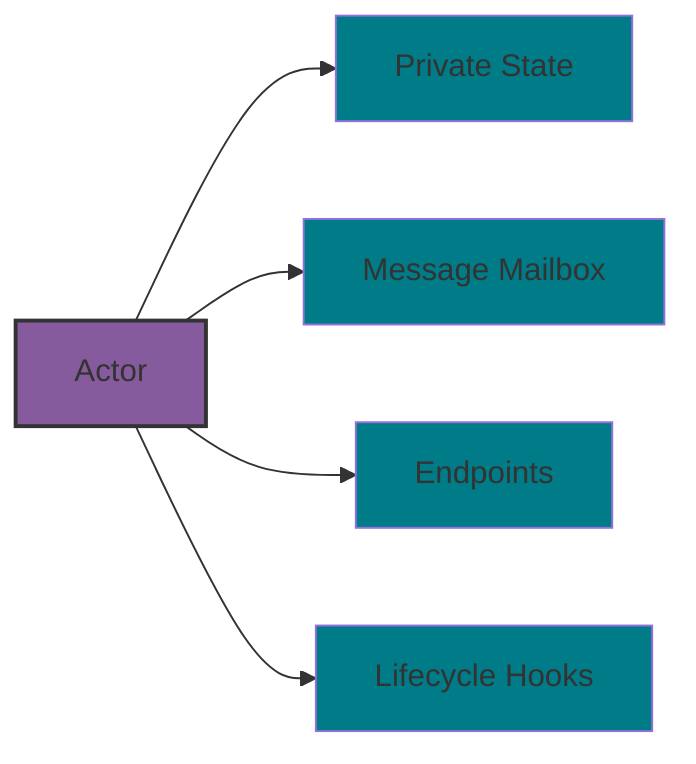

**1. Isolation**
- Each actor has its own private state
- State is never directly accessed by other actors
- All interaction happens through messages

**2. Sequential Processing**
- Messages are processed one at a time
- Next message waits until current message completes
- Guarantees consistent state within actor

**3. Asynchronous Communication**
- Messages are sent asynchronously
- Sender doesn't block waiting for response
- Results returned as Futures

**4. Location Transparency**
- Actors can be local or remote
- Same API regardless of location
- Framework handles serialization and routing

---

## Actor Lifecycle

### Lifecycle Stages

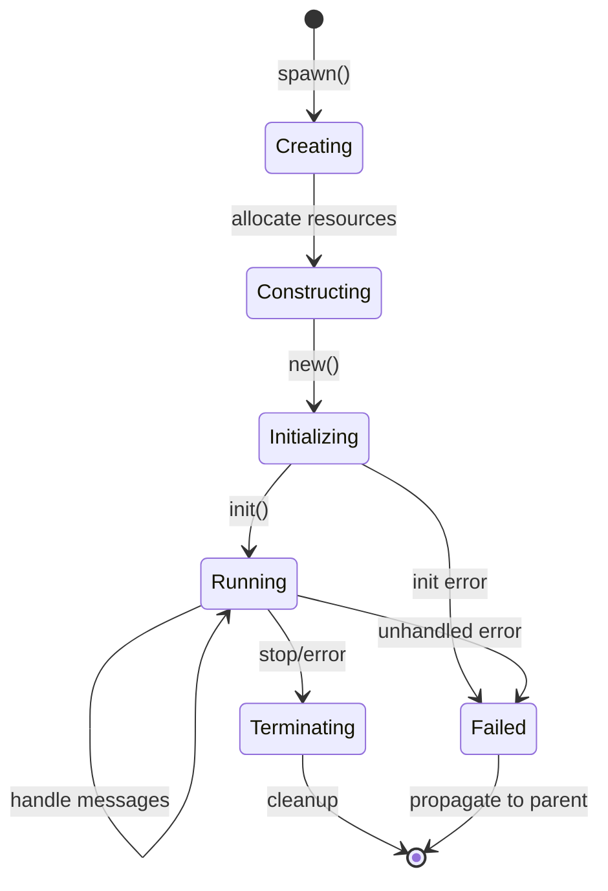

### 1. Creation Phase

**Spawning an Actor:**

```python
from monarch.actor import Actor, endpoint, this_proc

class MyActor(Actor):
    def __init__(self, param1: int, param2: str):
        self.param1 = param1
        self.param2 = param2
        self.state = {}

# Spawn on current process
actor = this_proc().spawn("my_actor", MyActor, param1=42, param2="hello")
```

**What Happens:**
1. Runtime allocates resources for the actor
2. Actor is registered in the runtime
3. Mailbox is created for message delivery
4. Actor ID is assigned

### 2. Construction Phase

**The `__init__` Method:**

```python
class DataProcessor(Actor):
    def __init__(self, buffer_size: int):
        # Initialize state
        self.buffer_size = buffer_size
        self.buffer = []
        self.processed_count = 0

        # NO MESSAGING YET - actor not fully registered
```

**Important Notes:**
- `__init__` is called during actor construction
- Actor cannot send/receive messages yet
- No access to runtime services
- Should only initialize state

### 3. Initialization Phase

**The `init` Hook (Optional):**

In Rust-based actors or custom Python actors, you can override the `init` method:

```python
class WorkerActor(Actor):
    def __init__(self, config):
        self.config = config
        self.resources = None

    async def init(self, this):
        # Now we have access to runtime
        # Can spawn child actors, send messages, etc.
        self.resources = await self.acquire_resources()
        self.worker_id = this.actor_id
```

### 4. Running Phase

Once initialized, the actor enters its main lifecycle where it processes messages.

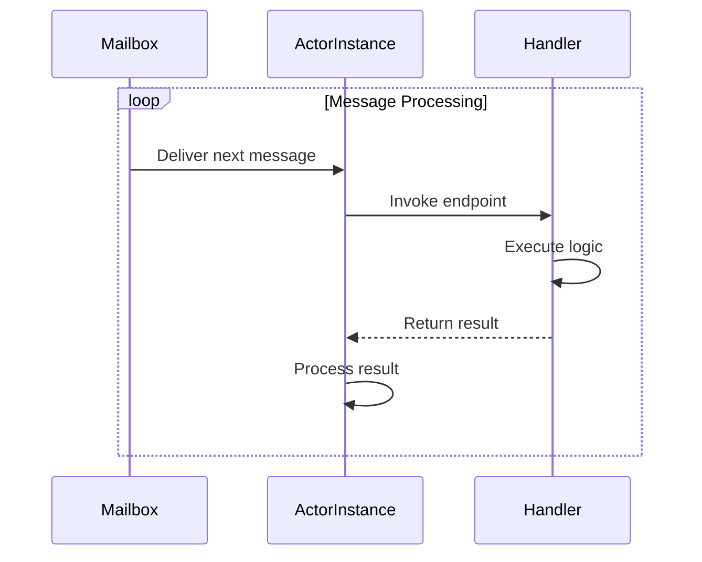

**Message Processing:**
- Actor waits for messages in mailbox
- Processes one message at a time
- Invokes corresponding endpoint handler
- Returns result or sends to port

### 5. Termination Phase

**Normal Termination:**
- All child actors terminated
- Mailbox drained
- Resources cleaned up
- Parent notified

**Error Termination:**
- Unhandled exception in handler
- Propagated to supervisor
- Supervision tree handles recovery (see [Error Handling in Meshes](#error-handling-in-meshes))
- All child actors terminated

---

## Endpoints and Messaging

### What are Endpoints?

**Endpoints** are methods decorated with `@endpoint` that define an actor's public API.

```python
from monarch.actor import Actor, endpoint

class Calculator(Actor):
    def __init__(self):
        self.history = []

    @endpoint
    def add(self, a: int, b: int) -> int:
        result = a + b
        self.history.append(("add", a, b, result))
        return result

    @endpoint
    def multiply(self, a: int, b: int) -> int:
        result = a * b
        self.history.append(("multiply", a, b, result))
        return result

    @endpoint
    def get_history(self) -> list:
        return self.history
```

### Messaging Adverbs

Endpoints support different invocation patterns called **adverbs**:

#### 1. `call_one()` - Single Actor Call

Call a single actor and get response.

```python
calc = this_proc().spawn("calc", Calculator)

# Synchronous wait for result
result = calc.add.call_one(5, 3).get()
print(result)  # 8

# Async await
result = await calc.add.call_one(5, 3)
```

**Use When:**
- Calling exactly one actor
- Need the result
- Point-to-point communication

**Flow Diagram:**

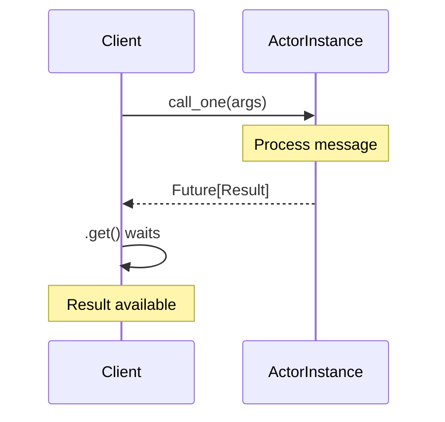

#### 2. `call()` - Broadcast and Collect

Broadcast to all actors in mesh and collect responses.

```python
calcs = procs.spawn("calcs", Calculator)  # Multiple actors

# Call all and collect results
results = calcs.add.call(10, 5).get()
print(results)  # [15, 15, 15, 15, 15, 15, 15, 15]
```

**Use When:**
- Broadcasting to multiple actors
- Need all responses
- Parallel computation

**Flow Diagram:**

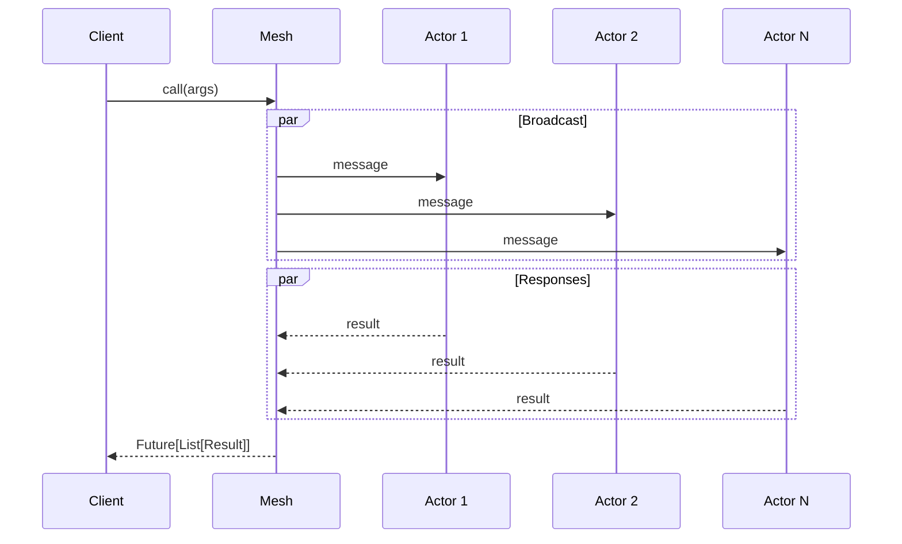

#### 3. `broadcast()` - Fire and Forget

Send to all actors without waiting for responses.

```python
trainers = procs.spawn("trainers", Trainer)

# Fire and forget
trainers.update_learning_rate.broadcast(0.001)

# Continues immediately, no waiting
next_operation()
```

**Use When:**
- Don't need responses
- Side effects only
- Maximum throughput needed

**Flow Diagram:**

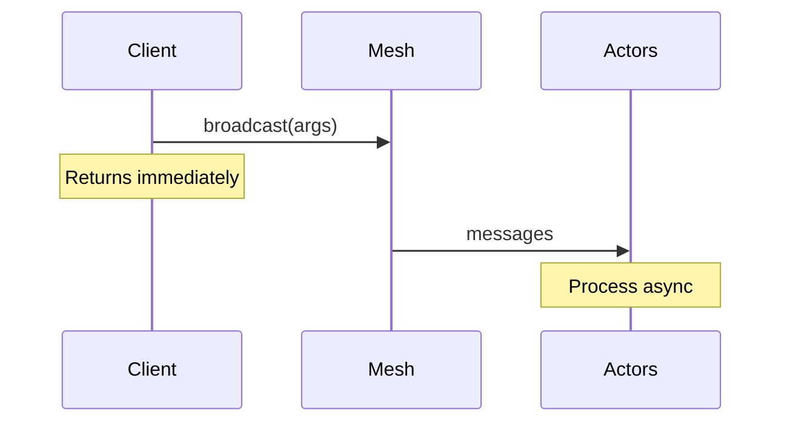

#### 4. `rref()` - Distributed Tensor Reference

Return distributed tensor from actor endpoint.

```python
class LinearActor(Actor):
    def __init__(self):
        self.weights = torch.rand(100, 100)

    @endpoint(propagate=lambda x: x)
    def forward(self, input):
        return input @ self.weights

linear = procs.spawn("linear", LinearActor)

# Returns distributed tensor reference
with procs.activate():
    x = torch.rand(10, 100)
    output = linear.forward.rref(x)  # Distributed tensor
    result = torch.relu(output)
```

**Use When:**
- Working with distributed tensors
- Need tensor operations across actors
- Building neural network layers

#### 5. `stream()` - Streaming Responses

Stream responses as they arrive.

```python
# Process responses as they come
async for result in workers.compute.stream(data):
    print(f"Got result: {result}")
    process_result(result)
```

**Use When:**
- Want to process results as they arrive
- Don't want to wait for all responses
- Pipeline processing

### Message Ordering

Monarch guarantees FIFO (First-In-First-Out) message ordering:

```python
actor.method1.call_one(arg1)  # Message M1
actor.method2.call_one(arg2)  # Message M2
actor.method3.call_one(arg3)  # Message M3

# Actor processes: M1, then M2, then M3 (in order)
```

**Ordering Diagram:**

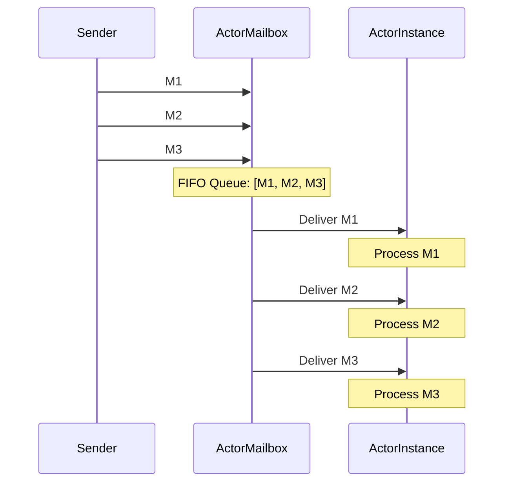

---

## Actor Context

### What is Context?

The **Context** provides runtime information about the current execution environment.

```python
from monarch.actor import context, Actor, endpoint

class ContextAwareActor(Actor):
    @endpoint
    def get_info(self):
        ctx = context()

        # Get current rank
        rank = ctx.message_rank

        # Get actor instance
        actor_inst = ctx.actor_instance

        # Get process reference
        proc = ctx.proc

        return {
            "rank": rank,
            "actor_id": actor_inst.actor_id,
            "proc_id": actor_inst.proc_id
        }
```

### Context Information

#### 1. Message Rank

The position in the mesh for the current message.

```python
@endpoint
def process(self):
    rank = context().message_rank
    # rank is a dict: {"hosts": 0, "gpus": 3}

    if rank["gpus"] == 0:
        print("I'm the first GPU!")
```

**Important:** Message rank may differ from actor rank when slicing:

```python
# Actor mesh: {"hosts": 4, "gpus": 8}
actors = procs.spawn("actors", MyActor)

# Slice to first 2 GPUs
subset = actors.slice(gpus=slice(0, 2))

# Inside actor:
# - actor_instance.rank = {"hosts": X, "gpus": Y}  (original position)
# - message_rank = {"hosts": X, "gpus": 0 or 1}     (position in slice)
```

#### 2. Actor Instance

Information about the actor itself.

```python
@endpoint
def get_details(self):
    inst = context().actor_instance

    return {
        "actor_id": inst.actor_id,  # Unique actor ID
        "rank": inst.rank,          # Position in mesh
        "proc": inst.proc,          # Process reference
    }
```

#### 3. Process Reference

Reference to the process hosting this actor.

```python
@endpoint
def spawn_sibling(self):
    # Get our process
    proc = context().proc

    # Spawn sibling actor on same process
    sibling = proc.spawn("sibling", SiblingActor)
    return sibling
```

### Context Usage Diagram

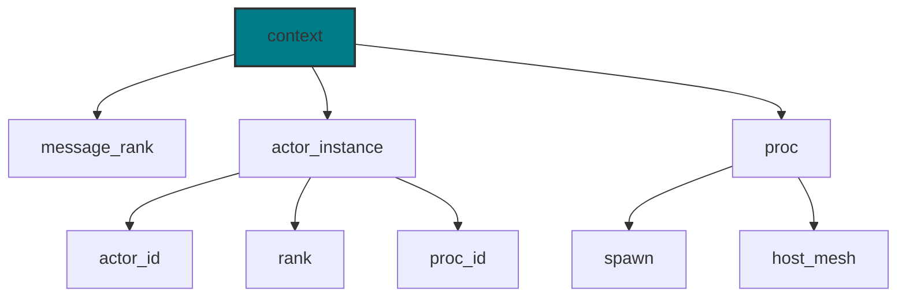

---

## ActorMesh

### What is ActorMesh?

An **ActorMesh** is a collection of actor instances organized in a multidimensional structure. It provides:
- Structured organization of actors
- Slicing and indexing operations
- Broadcast messaging
- Point-to-point references

### Creating ActorMesh

```python
# Create process mesh
procs = this_host().spawn_procs(per_host={"gpus": 8})

# Spawn actors (creates ActorMesh)
actors = procs.spawn("my_actors", MyActor, init_param=value)

print(type(actors))  # ActorMesh
print(actors.extent)  # {"gpus": 8}
```

### Mesh Structure

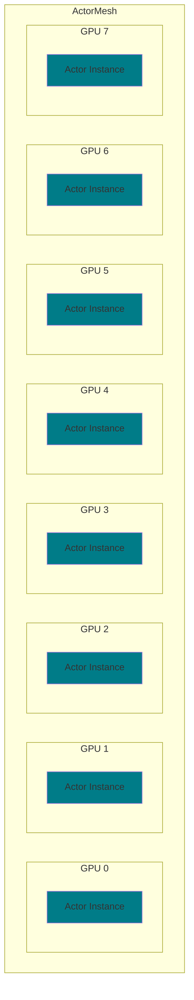

### Slicing Operations

#### Basic Slicing

```python
# Get single actor by index
actor_0 = actors.slice(gpus=0)

# Get range of actors
first_four = actors.slice(gpus=slice(0, 4))

# Multidimensional slicing
subset = actors.slice(hosts=slice(0, 2), gpus=slice(0, 4))
```

#### Slicing Patterns

```python
# All actors in mesh
actors.method.call()

# First GPU on each host
actors.slice(gpus=0).method.call()

# GPUs 0-3 on all hosts
actors.slice(gpus=slice(0, 4)).method.call()

# Specific point
actors.slice(hosts=1, gpus=3).method.call_one()
```

**Slicing Visualization:**

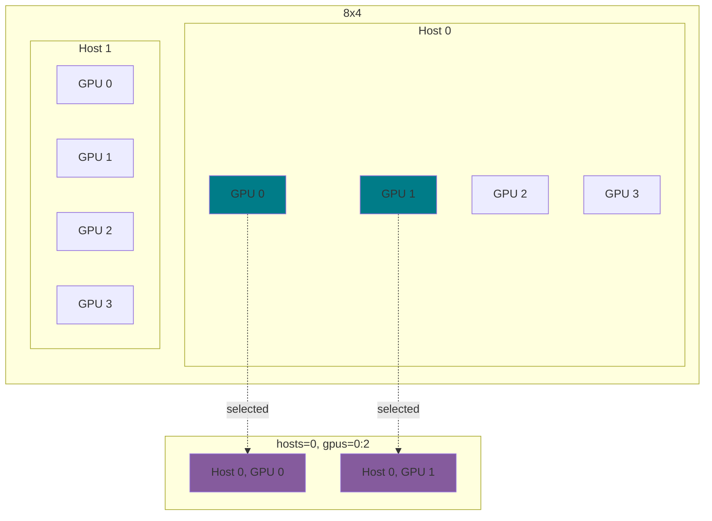

### Passing Actor References

Actors can be passed as arguments to other actors:

```python
class Server(Actor):
    @endpoint
    def serve(self):
        return "data"

class Client(Actor):
    def __init__(self, server: Server):
        # Select corresponding server
        rank = context().actor_instance.rank
        self.server = server.slice(**rank)

    @endpoint
    def fetch(self):
        return self.server.serve.call_one().get()

# Create both meshes
servers = server_procs.spawn("servers", Server)
clients = client_procs.spawn("clients", Client, servers)

# Clients can now communicate with servers
data = clients.fetch.call().get()
```

---

## Error Handling in Meshes

When you spawn procs and actors, you need to know when they encounter errors, and
have a chance to recover from them. This process is called "supervision", because
the owner of the resource (meshes of hosts, procs, actors) supervises them
to make sure they are making progress.

### Principles of ownership
We start with a set of principles we want to be true about ownership of resources,
such that we can make the guarantees for a good user experience:

1. Creating new meshes always results in an owned mesh. For example, if the holder of a ProcMesh reference spawns an actor, that operation returns an owned ActorMesh.
2. All meshes are owned by at most one actor. We do not support transfer or suspension of ownership. An actor can own multiple resources.
3. A mesh cannot outlive its owner – that is, when the owner stops or dies, so does the mesh.
4. If a mesh stops or dies, it will no longer handle any messages except for a final "cleanup" message. A stopped mesh will accept no new message, but drain all of its existing pending messages before cleanup. The owned mesh will run cleanup before its owner runs cleanup.

From these principles, we can also derive that ownership follows a strict hierarchy.
We can always draw a single path from any mesh to some "root" owner. This makes
the supervision hierarchy a tree. There are no orphan (managed) objects in the system: all failures must propagate.

The following is a further axiomitization, separating actor supervision from mesh lifecycle management:

#### Actors
Actors form a strict hierarchy of ownership. Typically the root of the hierarchy is the main script's client actor. We say that an actor is owned by its parent. A root actor is not owned.
When an actor fails, the failure propagates to its parent. The parent can handle the failure. When a failure is not handled, the parent actor fails. (Which causes its failure to be propagated in turn.) When the root actor fails, it invokes the user fault handler, which by default will exit the process.

#### Meshes:
All (host, proc, actor) meshes are owned by an actor. In turn, the lifecycle of the mesh is tied to that actor. If the actor stops (whether through failure or grace), then its own meshes are also stopped.
Mesh lifecycle events (for example, the failure of an actor in an actor mesh) generate failures that are also propagated to its owner actor; the rules from above apply.


### Supervision
From these follow the rules of supervision. We say that the owner of a mesh _supervises_ the mesh. This means that it is responsible for responding to _failures_ in that mesh. In principle, it does not matter how failures are instigated; the supervisor is always responsible for determining how to handle it.
Another important principle at play here is _encapsulation_: only the owner of a mesh knows how to handle mesh failure. No other component should need to know.
Thus, when a mesh fails in some way (for example, an actor failed), the owning actor receives a failure notification. In response to such failures, the actor must recover from the failure. If it fails to do so (either because it did not handle the event, or because it failed to recover the mesh properly), the _actor itself must fail_, cascading the failure up the ownership hierarchy. This causes all meshes owned by the actor to also fail. It is then up to the owner of the mesh to which that actor belongs to recover again.
This is similar to exception handling mechanisms: one can choose to handle exceptions at the appropriate level in the hierarchy (call stack), and failure to handle an exception propagates the failure (and thus terminates the remainder of functions in the call stack).

### Supervision Python API
Actors can handle failures by providing an implementation of the `__supervise__` method:
```py
class ManagerActor(Actor):
  def __init__(self, worker_procs: ProcMesh):
    # "workers" is now owned by this actor. If this actor fails, then
    # the "workers" mesh will also fail.
    self.workers = worker_procs.spawn("workers", WorkerActor)

  def __supervise__(self, failure: MeshFailure) -> bool:
    # This is invoked whenever an owned mesh fails.
    # The failure object can be stringified, and will contain the error message,
    # the actor name, and (sometimes) the rank that failed, if it can be determined.
    # The full API can be found on the MeshFailure typing stub:
    # monarch/python/monarch/_rust_bindings/monarch_hyperactor/supervision.pyi

    logging.error(f"failure encountered: {failure}")

    # To handle the event, return a truthy object. To consider it unhandled,
    # return a falsey object (such as None or False).
    return None
```

`__supervise__` is special: Because it handles "exceptions", we have to be able
to invoke it at any (safe) point. This is because otherwise we might run into a
deadlock: for example, an actor might be waiting for a result from a failed actor.
Thus, we define safe points (e.g., waiting for channel receives) at which we may
safely invoke the supervision handler. This means that __supervise__ handlers have
to be written carefully: it can potentially change the state of the actor in the middle of handling a message.

If `__supervise__` returns a truthy value, the failure will be considered handled
and not delivered further up the chain. If it returns a falsey value (including None, if there is no return),
the failure will be delivered to that Actor’s owner recursively until it reaches
the original client. If it reaches the original client with no handling, it will crash.
If `__supervise__` raises an Exception of any kind, it will be considered a new supervision event to be delivered to that Actor’s owner. Its cause will be set to the supervision event it was handling. This behavior matches the special method `__exit__` for context managers.

We make no guarantees about how many times `__supervise__` will be called.
If you own a mesh of N actors, each of which generates a supervision error, it may be called anywhere between 1 and N times inclusive.


---

## Advanced Patterns

### 1. Explicit Response Ports

For out-of-order responses or background processing:

```python
from monarch.actor import Port, endpoint
import threading
from queue import Queue

class AsyncProcessor(Actor):
    def __init__(self):
        self.queue = Queue()
        self.worker = threading.Thread(target=self._process_loop)
        self.worker.start()

    @endpoint(explicit_response_port=True)
    def process(self, port: Port[str], data: str):
        # Add to queue with response port
        self.queue.put((port, data))

    def _process_loop(self):
        while True:
            port, data = self.queue.get()
            # Process data
            result = self._heavy_computation(data)
            # Send response when ready
            port.send(result)
```

### 2. Actor Supervision

Custom supervision for fine-grained error handling:

```python
class SupervisorActor(Actor):
    def __init__(self):
        self.children = []

    def __supervise__(self, event):
        print(f"Supervision event: {event}")

        if event.is_recoverable():
            # Restart failed actor
            self.restart_child(event.actor_id)
            return True  # Handled
        else:
            # Propagate to parent
            return False

    @endpoint
    def spawn_worker(self):
        # Spawn supervised child
        worker = context().proc.spawn("worker", WorkerActor)
        self.children.append(worker)
        return worker
```

### 3. Channels for Direct Communication

Low-level messaging with channels:

```python
from monarch.actor import Channel, Port, PortReceiver

class Producer(Actor):
    def __init__(self):
        self.consumers = []

    @endpoint
    def register_consumer(self, port: Port):
        self.consumers.append(port)

    @endpoint
    def produce(self, data):
        # Send to all registered consumers
        for port in self.consumers:
            port.send(data)

class Consumer(Actor):
    def __init__(self, producer: Producer):
        # Create channel
        self.port, self.receiver = Channel.open()

        # Register with producer
        producer = producer.slice(gpus=0)
        producer.register_consumer.call_one(self.port)

    @endpoint
    async def consume(self):
        # Receive from channel
        data = await self.receiver.recv()
        return data
```

### 4. Value Mesh for State Sharing

Share readonly state across actor mesh:

```python
from monarch.actor import ValueMesh

class ConfigActor(Actor):
    def __init__(self, config_mesh: ValueMesh[dict]):
        # Each actor gets corresponding config
        rank = context().actor_instance.rank
        self.config = config_mesh[rank]

    @endpoint
    def get_config(self):
        return self.config

# Create value mesh
configs = [{"id": i, "param": i * 10} for i in range(8)]
config_mesh = ValueMesh.from_list(configs, extent={"gpus": 8})

# Spawn actors with value mesh
actors = procs.spawn("actors", ConfigActor, config_mesh)
```

---

## Best Practices

### 1. Actor Design

✅ **DO:**
- Keep actors focused on single responsibility
- Use immutable messages when possible
- Handle errors gracefully
- Document endpoint contracts

❌ **DON'T:**
- Share mutable state between actors
- Block in endpoints (use async)
- Ignore supervision events
- Create circular dependencies

### 2. State Management

```python
class GoodActor(Actor):
    def __init__(self):
        # All state in __init__
        self.counter = 0
        self.data = []

    @endpoint
    def update(self, value):
        # Modify state atomically
        self.counter += 1
        self.data.append(value)
        return self.counter

# Bad: External state
global_state = {}  # ❌ Don't do this

class BadActor(Actor):
    @endpoint
    def update(self, key, value):
        global_state[key] = value  # ❌ Race conditions!
```

### 3. Endpoint Design

```python
class WellDesignedActor(Actor):
    # ✅ Clear, typed endpoints
    @endpoint
    def process_batch(self, batch_id: int, data: list[float]) -> dict:
        """
        Process a batch of data.

        Args:
            batch_id: Unique batch identifier
            data: List of data points to process

        Returns:
            Dictionary with processing results
        """
        results = self._process(data)
        return {
            "batch_id": batch_id,
            "results": results,
            "processed_at": time.time()
        }
```

### 4. Error Handling

```python
class ResilientActor(Actor):
    @endpoint
    def risky_operation(self, data):
        try:
            result = self._process(data)
            return {"success": True, "result": result}
        except ValueError as e:
            # Log and return error
            logger.error(f"Invalid data: {e}")
            return {"success": False, "error": str(e)}
        except Exception as e:
            # Unexpected error - let supervision handle it
            logger.error(f"Unexpected error: {e}")
            raise
```

### 5. Performance Tips

```python
class OptimizedActor(Actor):
    def __init__(self):
        # ✅ Pre-allocate resources
        self.buffer = torch.zeros(1000, 1000)
        self.cache = {}

    @endpoint
    def compute(self, input_data):
        # ✅ Reuse buffers
        self.buffer.copy_(input_data)
        result = self._compute(self.buffer)

        # ✅ Cache expensive computations
        if input_data.id in self.cache:
            return self.cache[input_data.id]

        self.cache[input_data.id] = result
        return result
```

### 6. Testing Actors

```python
import pytest
from monarch.actor import this_proc

@pytest.mark.asyncio
async def test_calculator():
    # Spawn actor
    calc = this_proc().spawn("test_calc", Calculator)

    # Test endpoint
    result = await calc.add.call_one(5, 3)
    assert result == 8

    # Test history
    history = await calc.get_history.call_one()
    assert len(history) == 1
    assert history[0] == ("add", 5, 3, 8)
```

---

## Summary

### Key Takeaways

1. **Actors are Isolated**: Private state, message-based communication
2. **Sequential Processing**: One message at a time, FIFO ordering
3. **Typed Endpoints**: Clear API with type hints
4. **Location Transparent**: Same code for local/remote actors
5. **Supervision Tree**: Automatic error propagation and handling
6. **ActorMesh**: Multidimensional organization with slicing
7. **Context API**: Runtime information and services

### Actor Lifecycle Recap

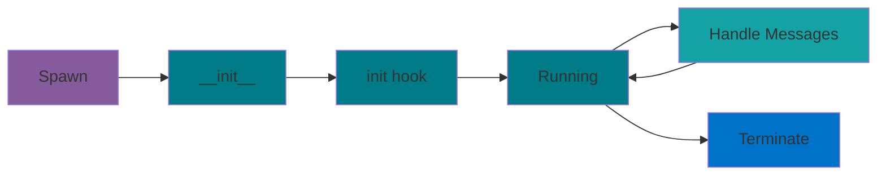

<!-- ### Next Steps

- Read [Mesh Concepts](./MESHES.md) for mesh details
- Explore [Examples](../examples/) for practical patterns
- Review [Getting Started](./source/examples/getting_started.py) tutorial -->

---

## Quick Reference Card

### Basic Actor

```python
from monarch.actor import Actor, endpoint, this_proc

class MyActor(Actor):
    def __init__(self, param):
        self.param = param

    @endpoint
    def method(self, arg):
        return self.param + arg

actor = this_proc().spawn("name", MyActor, param=10)
result = actor.method.call_one(5).get()  # 15
```

### Actor Mesh

```python
# Spawn mesh
actors = procs.spawn("actors", MyActor, param=10)

# Broadcast and collect
results = actors.method.call(5).get()

# Fire and forget
actors.method.broadcast(5)

# Slice
subset = actors.slice(gpus=slice(0, 4))
```

### Context

```python
from monarch.actor import context

@endpoint
def my_endpoint(self):
    ctx = context()
    rank = ctx.message_rank
    proc = ctx.proc
```

### Supervision

```python
class MySupervisor(Actor):
    def __supervise__(self, event):
        # Handle or propagate
        return True  # Handled
```
