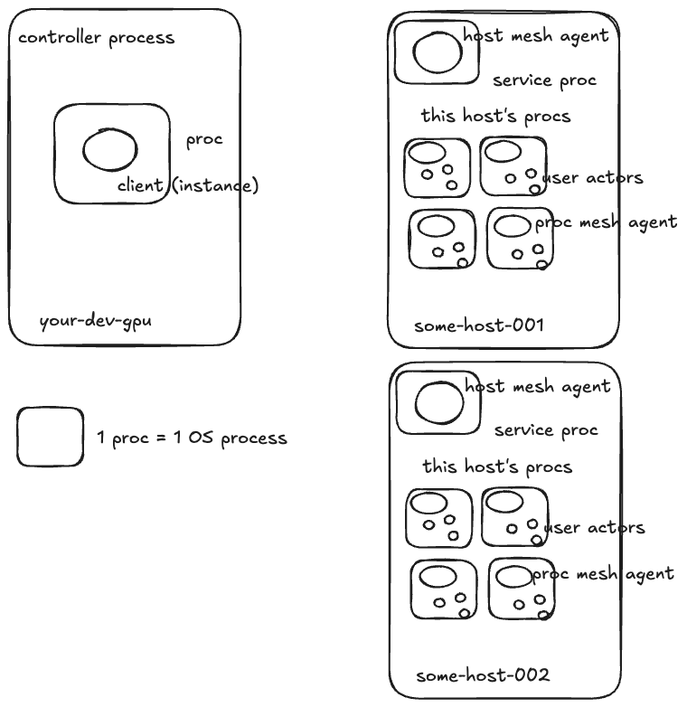

# Bootstrapping Overview

*One sentence:* the controller boots remote hosts, then spawns procs (**1 proc = 1 OS process**). Each host runs one **HostMeshAgent**; **every proc runs its own ProcMeshAgent** supervising that proc’s user/service actors.

<figure id="fig-arch" style="text-align:center;">
  
  <figcaption><strong>Figure 1.</strong> High-level architecture of the host, procs, and agents.</figcaption>
  

    Legend: ◻︎ = proc · ○ = actor (service or user).
  

</figure>

## What you’re looking at

- **Controller process** (left): owns orchestration APIs and kicks off bootstrapping.
- **HostMeshAgent** (one per host): manages host-local resources and the service proc.
- **ProcMeshAgent** (one per proc): supervises that proc’s actors (service + user).
- **Procs** (squares): runtime containers; *1 proc = 1 OS process*.

## Boot sequence (10k-ft)

1. Obtain a **proc + instance** (control endpoint).
2. Use the **v0 process allocator** and **bootstrap handshake** to get remote runtimes.
3. Promote those runtimes into real **hosts** (start HostMeshAgent).
4. **Spawn procs and actors** on those hosts (start proc/ProcMeshAgent, spawn  actors).

_For the full, runnable test (see `bootstrap_canonical_simple`), see the appendix._
