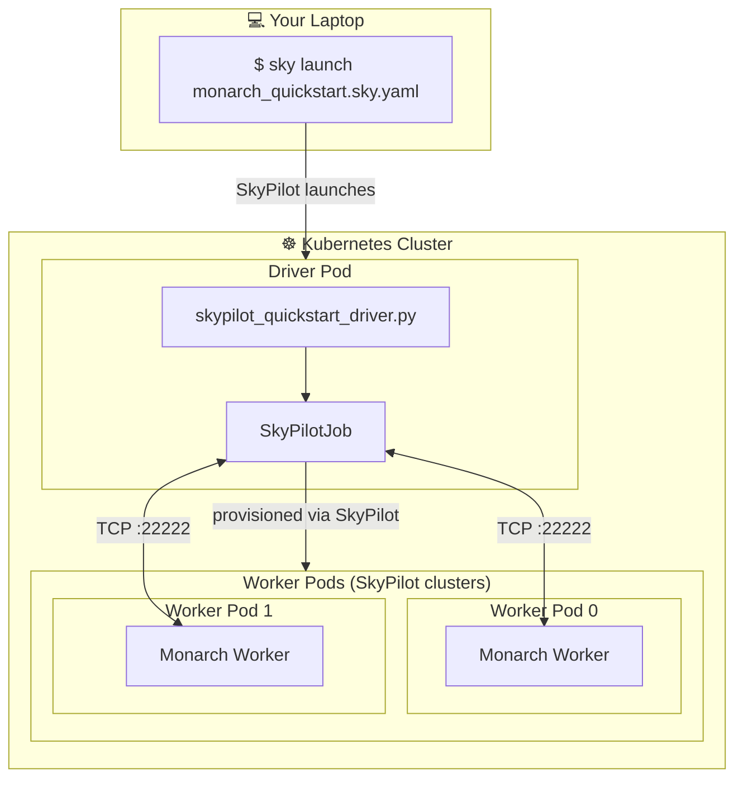

# Running Monarch on Kubernetes and cloud VMs via SkyPilot

This directory contains examples for running Monarch workloads on **Kubernetes and cloud VMs** via [SkyPilot](https://github.com/skypilot-org/skypilot).

## Overview

`SkyPilotJob` provisions cloud instances (or K8s pods) and starts Monarch workers on them, allowing you to run distributed Monarch actors across multiple Kubernetes pods.

### Architecture



**How it works:**
1. You run `sky launch` from your laptop to start the driver pod
2. The driver runs `skypilot_quickstart_driver.py` which creates a `SkyPilotJob`
3. `SkyPilotJob` provisions GPU worker pods via SkyPilot
4. The driver connects to Monarch workers over TCP (port 22222)
5. Actors are spawned on each GPU and execute your distributed code

**Supported infra:**
- Kubernetes (any cluster)
- Hyperscalers: AWS, GCP, Azure
- Neoclouds: CoreWeave, Nebius, and [20+ other clouds](https://docs.skypilot.co/en/latest/getting-started/installation.html)

## Quickstart

Prerequisites: Install SkyPilot and verify GPUs are available.
<details>
<summary><strong>SkyPilot Installation</strong></summary>

```bash
# Install SkyPilot with your preferred backend
pip install skypilot[kubernetes]  # For Kubernetes
pip install skypilot[aws]         # For AWS
pip install skypilot[gcp]         # For GCP
pip install skypilot[all]         # For all clouds

# Verify SkyPilot setup
sky check

# Verify GPUs available
sky show-gpus --infra kubernetes
```

For more details, see the [SkyPilot documentation](https://docs.skypilot.co/en/latest/getting-started/installation.html).

</details>


Run this command from your local machine to run the getting started example:

```bash
sky launch monarch_quickstart.sky.yaml -c monarch-demo
```

<details>
<summary><strong>💡 Customizing the run (GPU count, CPU-only mode, etc.)</strong></summary>

Run `sky show-gpus --infra kubernetes` to see available GPUs in your cluster, then customize with environment variables:

```bash
# Custom GPU configuration
sky launch monarch_quickstart.sky.yaml -c monarch-demo \
  --env NUM_HOSTS=4 \
  --env GPUS_PER_HOST=8 \
  --env ACCELERATOR="H100:8"

# CPU-only mode (no GPUs required)
sky launch monarch_quickstart.sky.yaml -c monarch-demo \
  --env GPUS_PER_HOST=0 \
  --env ACCELERATOR=none
```

</details>


On running `sky launch`, SkyPilot will:
1. Launch a Kubernetes pod
2. Install dependencies
3. Sync the example directory with the pod
4. Run `skypilot_quickstart_driver.py` in the pod and stream the logs

<details>
<summary><strong>Example Output</strong></summary>

```
============================================================
Monarch Getting Started with SkyPilot
============================================================

Configuration:
  Cloud: kubernetes
  Hosts: 2
  GPUs per host: 1
  Accelerator: H200:1
  Cluster name: monarch-skypilot-test

[1] Creating SkyPilot job...

[2] Launching cluster and starting Monarch workers...
No cached job found at path: .monarch/job_state.pkl
Applying current job
Launching SkyPilot cluster 'monarch-skypilot-test' with 2 nodes
Running on cluster: monarch-skypilot-test
SkyPilot cluster 'monarch-skypilot-test' launched successfully
Waiting for job 1 setup to complete (timeout=300s)...
Job 1 status: JobStatus.SETTING_UP (waited 5s)
Job 1 is now RUNNING (setup complete)
Saving job to cache at .monarch/job_state.pkl
Job has started, connecting to current state
Found 2 nodes ready
Connecting to workers for mesh 'trainers': ['tcp://10.0.4.22:22222', 'tcp://10.0.4.112:22222']
Monarch internal logs are being written to /tmp/sky/monarch_log.log; execution id sky_Dec-11_01:31_653
Waiting for host mesh 'trainers' to initialize...
Host mesh 'trainers' initialized successfully
Host mesh 'trainers' ready
    Got host mesh with extent: {hosts: 2}

[3] Spawning processes on cloud hosts...
    Process mesh extent: {hosts: 2, gpus: 1}

[4] Spawning Counter actors...

[5] Broadcasting increment to all counters...

[6] Getting counter values...
    Counter values: ValueMesh({hosts: 2, gpus: 1}):
  (({'hosts': 0/2, 'gpus': 0/1}, 3), ({'hosts': 1/2, 'gpus': 0/1}, 3))

[7] Spawning Trainer actors...

[8] Performing distributed training step...
    ({'hosts': 0/2, 'gpus': 0/1}, "Trainer {'hosts': 0/2, 'gpus': 0/1} taking a step.")
    ({'hosts': 1/2, 'gpus': 0/1}, "Trainer {'hosts': 1/2, 'gpus': 0/1} taking a step.")

[9] Getting trainer info...
    ({'hosts': 0/2, 'gpus': 0/1}, "Trainer at rank {'hosts': 0/2, 'gpus': 0/1}")
    ({'hosts': 1/2, 'gpus': 0/1}, "Trainer at rank {'hosts': 1/2, 'gpus': 0/1}")

============================================================
Success! Monarch actors ran on SkyPilot cluster!
============================================================

[10] Cleaning up SkyPilot cluster...
Tearing down SkyPilot cluster 'monarch-skypilot-test'
Cluster 'monarch-skypilot-test' terminated
    Cluster terminated.
```

</details>

When done, clean up with:
```bash
sky down monarch-demo
```


<details>
<summary><strong>Running from within the Kubernetes cluster</strong></summary>

If you are already in the Kubernetes cluster you'd like to run workers on, you can directly run `skypilot_quickstart_driver.py`.

```bash
# With GPUs
python skypilot_quickstart_driver.py --cloud kubernetes --num-hosts 2 --gpus-per-host 8 --accelerator "H200:8"

# CPU-only (no GPUs)
python skypilot_quickstart_driver.py --cloud kubernetes --num-hosts 2 --gpus-per-host 0 --accelerator none
```

</details>

### Running the DDP Jupyter Notebook

To run the `skypilot_ddp.ipynb` notebook interactively, first launch a driver pod and then connect via SSH port forwarding:

```bash
# 1. Launch a driver pod (without running a script)
sky launch monarch_quickstart.sky.yaml -c monarch-demo

# 2. SSH into the pod with port forwarding for Jupyter
ssh monarch-demo -L 8888:localhost:8888

# 3. Inside the pod, start Jupyter Notebook
cd ~/sky_workdir
uv pip install --system jupyter
jupyter notebook --no-browser --port=8888 --ip=0.0.0.0 --NotebookApp.token='' --NotebookApp.password='' --allow-root
```

Then open http://localhost:8888 in your browser and open `skypilot_ddp.ipynb`.

When done, clean up with:
```bash
sky down monarch-demo
```

## SkyPilotJob Class

SkyPilotJob allows you to run Monarch on Kubernetes and cloud VMs via SkyPilot.

Example usage:

```python
import sky
from monarch_skypilot import SkyPilotJob
from monarch.actor import Actor, endpoint

class MyActor(Actor):
    @endpoint
    def hello(self) -> str:
        return "Hello from the cloud!"

# Create a SkyPilot job with 2 nodes
job = SkyPilotJob(
    meshes={"workers": 2},
    resources=sky.Resources(
        cloud=sky.Kubernetes(),  # or sky.AWS(), sky.GCP(), etc.
        accelerators="H100:1",
    ),
    cluster_name="my-monarch-cluster",
    idle_minutes_to_autostop=10,
    down_on_autostop=True,
)

# Launch and connect
state = job.state()
hosts = state.workers

# Spawn processes and actors
procs = hosts.spawn_procs(per_host={"gpus": 1})
actors = procs.spawn("my_actors", MyActor)

# Use your actors
results = actors.hello.call().get()
print(results)  # ["Hello from the cloud!", "Hello from the cloud!"]

# Clean up
job.kill()
```

### Network Requirements

The client must have direct network connectivity to the worker nodes:
- **Kubernetes**: Run the client inside the same cluster (e.g., in a pod)
- **Cloud VMs**: Ensure security groups allow inbound traffic on port 22222


### Default Image

By default, `SkyPilotJob` uses the `pytorch/pytorch:2.9.1-cuda12.8-cudnn9-runtime` Docker image which has compatible system libraries for `torchmonarch-nightly`.

## Troubleshooting tips

**Check SkyPilot setup:**
```bash
sky check
sky show-gpus
```

**View cluster logs:**
```bash
sky logs <cluster-name>
```

**SSH into a worker:**
```bash
sky ssh <cluster-name>
```

**Clean up clusters:**
```bash
sky down <cluster-name>
sky down --all  # Remove all clusters
```
